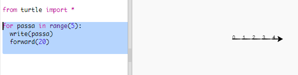
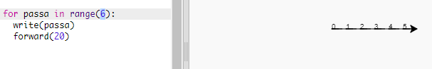
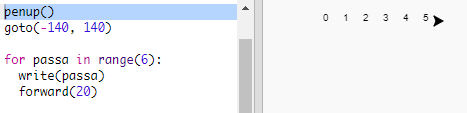
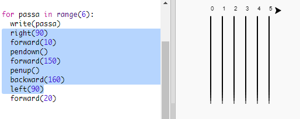
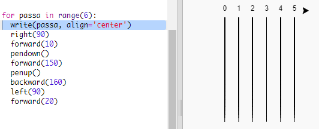

## Race track

Crearàs un joc amb tortugues corredores. El primer que necessitaran és un circuit.

+ Obre la plantilla Python en blanc a Trinket: <a href="http://jumpto.cc/python-new" target="_blank">jumpto.cc/python-new</a>.

+ Afegeix el codi següent per dibuixar una línia mitjançant la 'tortuga':
    
    

+ Ara utilitzarem la tortuga per dibuixar algunes marques de pista per a la cursa.
    
    La funció `write` de la tortuga escriu text a la pantalla.
    
    Prova-ho:
    
    

+ Ara has d'omplir amb números per enumerar les marques:
    
    

+ T'has adonat que el teu codi és molt repetitiu? L’únic que canvia és el número a escriure.
    
    Hi ha una manera millor de fer això a Python. Pots utilitzar un bucle `for`.
    
    Update your code to use a `for` loop:
    
    

+ Hmm, that only prints numbers up to 4. In Python `range(5)` returns five numbers, from 0 up to 4. To get it to also return 5 you'll need to use `range(6)`:
    
    

+ Now we can draw some track markings. The turtle starts at coordinates (0,0) in the middle of the screen.
    
    Move the turtle to the top left instead:
    
    

+ Ah, you'll want to lift the pen up first!
    
    

+ Instead of drawing a line horizontally, let's draw vertical lines to create a track:
    
    
    
    `right(90)` makes the turtle turn right 90 degrees (a right angle.) Moving `forward(10)` before putting the pen down leaves a small gap between the number and the start of the line. After drawing the line you lift up the pen and go `backward(160)` the length of the line plus the gap.

+ It looks neater if you centre the numbers:
    
    

+ And you can speed up the turtle so it draws faster:
    
    