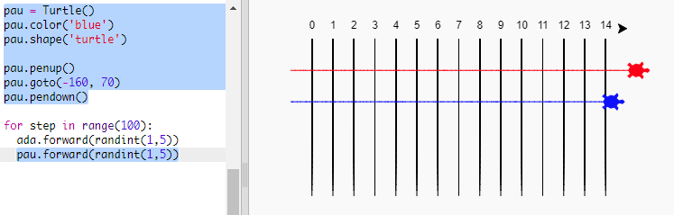

## Tortugues corredores

Ara una mica més de diversió. Afegim algunes tortugues de cursa. Seria realment avorrit si les tortugues fessin el mateix cada vegada, per la qual cosa es mouran un nombre aleatori de passos cada torn. La tortuga guanyadora serà la que arribi més lluny en 100 voltes.

+ Quan fas servir comandes com `forward(20)` estàs fent servir una única tortuga. Però pots crear més tortugues. Afegeix el següent codi al final del teu programa (però assegura't que no tingui sagnat):
    
    
    
    La primera línia crea una tortuga anomenada "ada". Les següents línies estableixen el color i la forma de la tortuga. Ara realment sembla una tortuga!

+ Anem a enviar la tortuga a la línia de sortida:
    
    

+ Ara has de fer que la tortuga corri movent-se un nombre aleatori de passos alhora. Necessitaràs la funció `randint` de la biblioteca de Python `random`. Afegeix aquesta línia `import` a la part superior del teu codi:
    
    

+ The `randint` function returns a random integer (whole number) between the values chosen. The turtle will move forward 1, 2, 3, 4, or 5 steps at each turn.
    
    

+ One turtle isn't much of a race! Let's add another one:
    
    
    
    Note that the code for moving the blue turtle needs to be in **the same** `for` loop as the code for moving the red turtle so that they each make a move every turn.