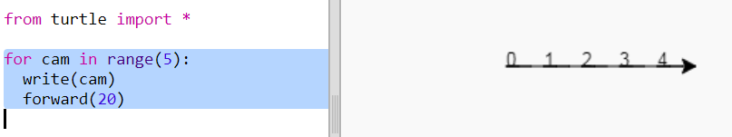
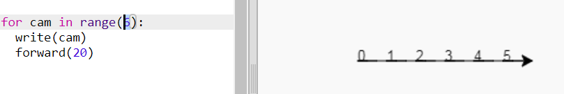
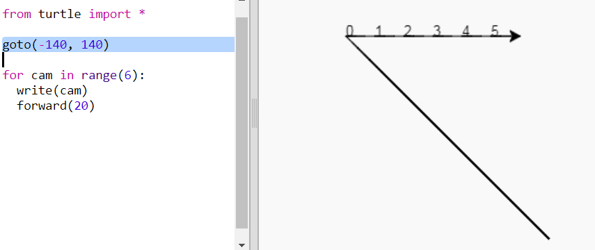
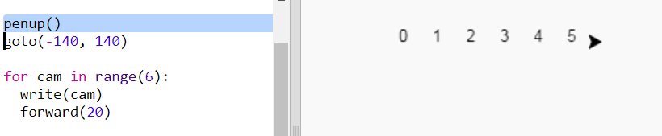
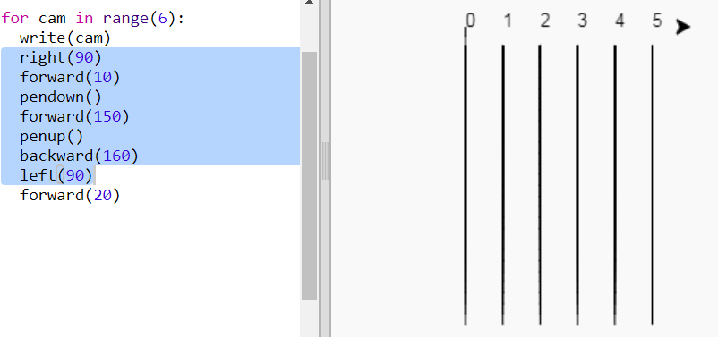
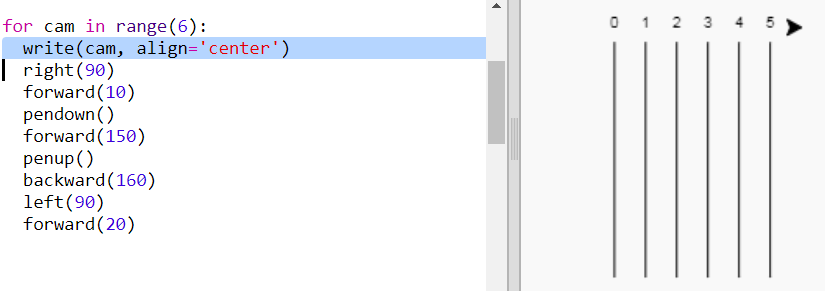

## Trac rasio

Rydych chi'n mynd i greu gêm gyda chrwbanod rasio. Yn gyntaf bydd angen trac rasio arnyn nhw.

+ Agorwch y templed Python gwag Trinket: <a href="http://jumpto.cc/python-new" target="_blank">jumpto.cc/python-new</a>.

+ Ychwanegwch y cod canlynol i dynnu llinell gan ddefnyddio'r 'crwban':
    
    

+ Nawr, gadewch i ni ddefnyddio'r crwban i dynnu llun o rai marciau trac ar gyfer y ras.
    
    Mae swyddogaeth `write` (ysgrifennu) y crwban yn ysgrifennu testun i'r sgrin.
    
    Rhowch gynnig arni:
    
    

+ Nawr mae angen i chi lenwi'r rhifau rhyngddynt i greu marciau:
    
    

+ Wnaethoch chi sylwi bod eich cod yn ailadroddus iawn? Yr unig beth sy'n newid yw'r rhif i'w ysgrifennu.
    
    Mae ffordd well o wneud hyn yn Python. Gallwch chi ddefnyddio dolen `for` (ar gyfer).
    
    Diweddarwch eich cod i ddefnyddio dolen `for` (ar gyfer):
    
    

+ Hmm, mae hynny'n argraffu rhifau hyd at 4 yn unig. Yn Python mae `range(5)` (ystod(5)) yn dychwelyd pum rhif, o 0 i fyny at 4. Er mwyn ei gael i ddychwelyd 5 hefyd bydd angen i chi ddefnyddio `range(6)`:
    
    

+ Nawr gallwn dynnu llun o rai marciau trac. Mae'r crwban yn dechrau ar gyfesurynnau (0,0) yng nghanol y sgrin.
    
    Symudwch y crwban i'r chwith ar y brig yn lle hynny:
    
    

+ Ah, byddwch chi am godi'r pen yn gyntaf!
    
    

+ Yn lle tynnu llinell yn llorweddol, gadewch i ni dynnu llinellau fertigol i greu trac:
    
    
    
    Mae `right(90)` (de) yn gwneud i'r crwban droi 90 gradd i'r dde (ongl sgwâr) Mae symud `forward(10)` (ymlaen) cyn rhoi'r pen i lawr yn gadael bwlch bach rhwng y rhif a dechrau'r llinell. Ar ôl tynnu'r llinell, byddwch chi'n codi'r pen ac yn mynd `backward(160)` (yn ôl) hyd y llinell ynghyd â'r bwlch.

+ Mae'n edrych yn daclusach os ydych chi'n canoli'r rhifau:
    
    

+ A gallwch chi gyflymu'r crwban fel ei fod yn tynnu llun yn gyflymach:
    
    