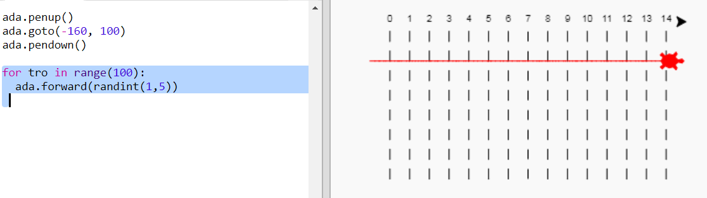
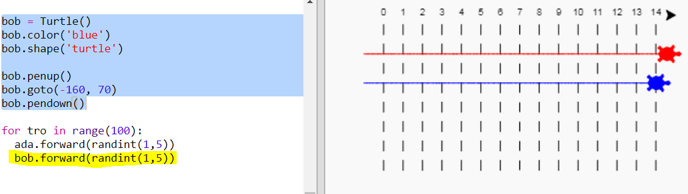

## Crwbanod rasio

Nawr am y rhan hwyliog. Gadewch i ni ychwanegu rhai crwbanod rasio. Byddai'n ddiflas iawn pe bai crwbanod yn gwneud yr un peth bob tro, felly, byddant yn symud nifer o gamau ar hap pob tro. Yr enillydd yw'r crwban sy'n mynd bellaf mewn 100 tro.

+ Pan fyddwch chi'n defnyddio gorchmynion fel `forward (20)` (ymlaen) rydych chi'n defnyddio un crwban. Ond gallwch chi greu mwy o grwbanod. Ychwanegwch y cod canlynol at ddiwedd eich sgript (ond gwnewch yn siŵr nad yw wedi'i fewnoli):
    
    
    
    Mae'r llinell gyntaf yn creu crwban o'r enw 'ada'. Mae'r llinellau nesaf yn gosod lliw a siâp y crwban. Nawr mae'n edrych yn wirioneddol fel crwban!

+ Gadewch i ni anfon y crwban i'r llinell gychwyn:
    
    

+ Nawr mae angen i chi wneud i'r crwban rasio trwy symud nifer o gamau ar hap ar y tro. Bydd angen y swyddogaeth `randint` (cyfranrifau ar hap) arnoch chi gan Llyfrgell `random` (ar hap) Python. Ychwanegwch y llinell `import` (fewnforio) hon i frig eich sgript:
    
    

+ Mae'r swyddogaeth `randint` yn dychwelyd cyfanrif (rhif cyfan) hap rhwng y gwerthoedd a ddewiswyd. Bydd y crwban yn symud ymlaen 1, 2, 3, 4, neu 5 cam ar bob tro.
    
    

+ Nid yw un crwban yn llawer o ras! Gadewch i ni ychwanegu un arall:
    
    
    
    Sylwch fod angen i'r cod ar gyfer symud y crwban glas fod yn **yr un** ddolen `for` (ar gyfer) â'r cod ar gyfer symud y crwban coch fel eu bod nhw i gyd yn gwneud symudiad bob tro.