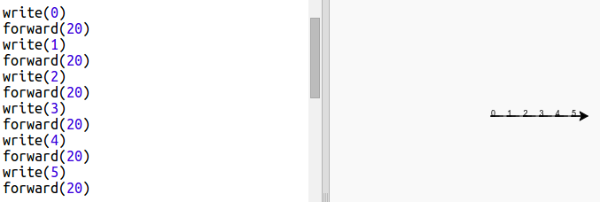
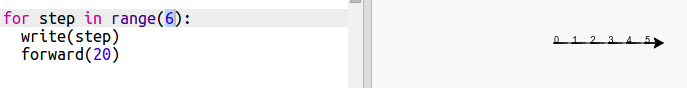
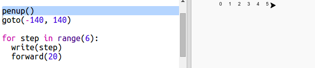
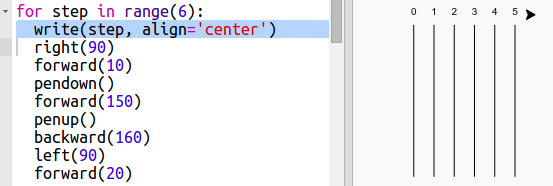
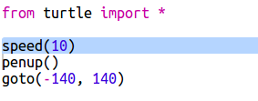

## Racerbane

Du kommer til at lave et spil med racer skildpadder. Først har skildpadderne brug for en racerbane.

+ Åben det blanke Python template Trinket: <a href="http://jumpto.cc/python-new" target="_blank">jumpto.cc/python-new</a>. 

+ Tilføj den følgende kode til at tegne en linje ved at bruge 'skildpadden':

  
   
+ Lad os nu bruge skildpadden til at tegne nogle banemarkeringer til racet.

  Skildpadde-funktionen `write` udskriver tekst på skærmen. 
  
  Prøv det:

  
  
+ Nu har du brug for at udskrive tallene imellem for at lave markeringer:

  
  
+ Bemærkede du at din kode er meget gentagende? Det eneste der ændrer sig, er tallet der skal udskrives.

  Der er en bedre måde at gøre dette på i Python. Du kan bruge et `for` loop. 
  
  Updater din kode, så den bruger et `for` loop:
  
  
   
+ Hmm, der bliver kun printet tal op til 4. I Python skriver `range(5)` fem tal fra 0 og op til 4. For at få Python til også at skriev et 5-tal, er du nødt til at bruge `range(6)`:

  
   
+ Nu kan vi tegne nogle banemarkeringer. Skildpadden starter ved koordinaterne (0,0), lige i midten af skærmen. 

  Flyt skildpadden øverst til venstre i stedet for:
  
  

+ Ah, du bør nok løfte blyanten først!

  
  
+ I stedet for at tegne en linje vandret, så lad os tegne lodrette linjer for at lave en racerbane:

  
  
  `right(90)` får skildpadden til at dreje 90 grader til højre. Ved at flytte fremad med `forward(10)` før du sætter blyanten ned, så flytter du skildpadden frem uden at tegne og efterlader et lille hul mellem tallet og starten af linjen. Efter at have tegnet linjen løfter du blyanten og går tilbage med `backward(160)`, som er længden af linjen plus hullet. 
  
+ Det ser pænere ud hvis du centrerer tallene:

  

+ Du kan også øge skildpaddens hastighed, så den tegner hurtigere:

  

