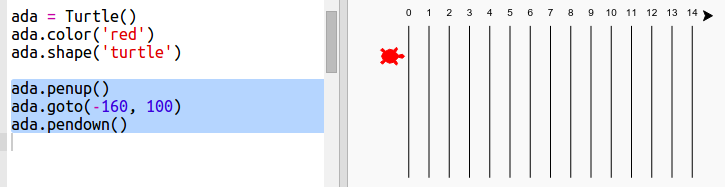

## Racer skildpadder

Nu til den sjove del. Lad os tilføje racer skildpadder. Det ville være virkelig kedeligt, hvis skildpadderne gjorde det samme hver gang, så vi vil i stedet programmere dem til at bevæge sig et tilfældigt antal skridt hver runde. Vinderen er den skildpadde, der kom længst på 100 runder.

+ Når du bruger kommandoer som `forward(20)`, bruger du en enkelt skildpadde. Men du kan lave flere skildpadder. Tilføj den følgende kode til slutningen af dit script (men vær sikker på, det ikke er indrykket):

  

  Den første linje laver en skildpadde kaldt 'ada'. De næste linjer sætter farven og formen af skildpadden. Nu ligner det virkeligt en skildpadde!
  
+ Lad os sende skildpadden til startlinjen:

  
   
+ Nu skal du få skildpadden til at flytte et tilfældigt antal skridt hver runde. Du har brug for `randint` funktionen fra Python biblioteket `random`. Tilføj denne `import` linje øverst i dit script:

  

+ Funktionen `randint` sender et tilfældigt integer (heltal) mellem de valgt værdier tilbage. Skildpadden vil bevæge sig fremad 1, 2, 3, 4, eller 5 skridt hver runde. 

  
  
+ Der er dog ikke meget race med kun en skildpadde! Lad os tilføje en til:

  
  
  Bemærk at koden til at fløtte den blå skildpadde skal være i __den samme__ `for` loop som koden til at flytte den røde skildpadde, så de begge bevæger sig i hver runde. 
  

