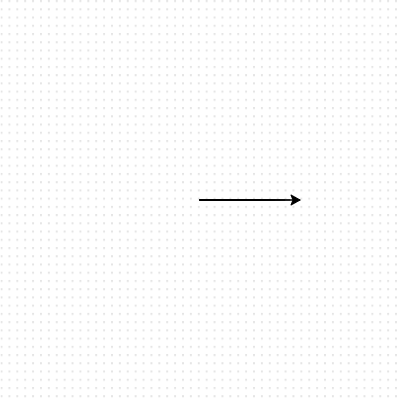
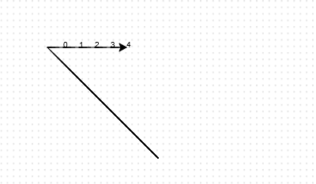
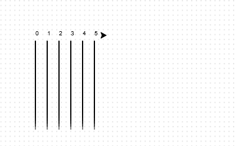

## Race track

You're going to create a game with racing turtles. First they'll need a race track.

--- task ---

Open the [Rock, Paper, Scissors](https://editor.raspberrypi.org/en/projects/turtle-race-starter){:target="_blank"} project. The code editor will open in another browser tab.

--- /task ---

--- task ---

Add the following code to draw a line using the 'turtle' and click **Run**.

--- code ---
---
language: python
filename: main.py
line_numbers: true
line_number_start: 1
line_highlights: 1, 3
---
from turtle import *

forward(100)
--- /code ---

--- /task ---

--- task ---

Now let's use the turtle to draw some track markings for the race. 

The turtle `write` function writes text to the screen. 
  
Try it:

--- code ---
---
language: python
filename: main.py
line_numbers: true
line_number_start: 1
line_highlights: 3, 5
---
from turtle import *

write(0)
forward(100)
write(5)
--- /code ---

--- /task ---

--- task ---

Now you need to fill in the numbers in between to create markings:

--- code ---
---
language: python
filename: main.py
line_numbers: true
line_number_start: 1
line_highlights: 4-12
---
from turtle import *

write(0)
forward(20)
write(2)
forward(20)
write(3)
forward(20)
write(4)
forward(20)
write(5)
forward(20)
--- /code ---

--- /task ---

  
Did you notice that your code is very repetitive? The only thing that changes is the number to write.

There's a better way of doing this in Python. You can use a `for` loop. 

--- task ---

Update your code to use a `for` loop:

--- code ---
---
language: python
filename: main.py
line_numbers: true
line_number_start: 1
line_highlights: 3-5
---
from turtle import *

for step in range(5):
    forward(20)
    write(step)
--- /code ---

--- /task ---

--- task ---

Hmm, that only prints numbers up to 4. In Python `range(5)` returns five numbers, from 0 up to 4. To get it to also return 5 you'll need to use `range(6)`:

--- code ---
---
language: python
filename: main.py
line_numbers: true
line_number_start: 1
line_highlights: 3
---
from turtle import *

for step in range(6):
    forward(20)
    write(step)
--- /code ---

--- /task ---   

--- task ---

Now we can draw some track markings. The turtle starts at coordinates (0,0). 

Move the turtle to the top left instead:

--- code ---
---
language: python
filename: main.py
line_numbers: true
line_number_start: 1
line_highlights: 3
---
from turtle import *

goto(-140, 140)

for step in range(6):
    forward(20)
    write(step)
--- /code ---

--- /task ---

--- task ---

Ah, you'll want to lift the pen up first!

--- code ---
---
language: python
filename: main.py
line_numbers: true
line_number_start: 1
line_highlights: 3
---
from turtle import *

penup()
goto(-140, 140)

for step in range(6):
    forward(20)
    write(step)
--- /code ---

--- /task ---

--- task ---

Instead of drawing a line horizontally, let's draw vertical lines to create a track:

--- code ---
---
language: python
filename: main.py
line_numbers: true
line_number_start: 6
line_highlights: 8-14
---
for step in range(6):
    write(step)
    right(90)
    forward(10)  
    pendown()
    forward(150) 
    penup()
    backward(160) 
    left(90)
    forward(20) 
--- /code ---

--- /task ---

  
`right(90)` makes the turtle turn right 90 degrees (a right angle.) Moving `forward(10)` before putting the pen down leaves a small gap between the number and the start of the line. After drawing the line you lift up the pen and go `backward(160)` the length of the line plus the gap. 

--- task ---

It looks neater if you centre the numbers:

--- code ---
---
language: python
filename: main.py
line_numbers: true
line_number_start: 6
line_highlights: 7
---
for step in range(6):
    write(step, align='center')
--- /code ---

--- /task ---

--- task ---

And you can speed up the turtle so it draws faster:

--- code ---
---
language: python
filename: main.py
line_numbers: true
line_number_start: 1
line_highlights: 3
---
from turtle import *

speed(10)
penup()
goto(-140, 140)
--- /code ---

--- /task ---

