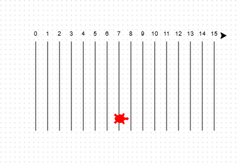
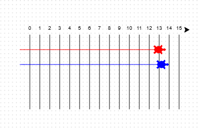

## Racing turtles

Now for the fun bit. Let's add some racing turtles. It would be really boring if the turtles did the same thing every time so they will move a random number of steps each turn. The winner is the turtle that gets the furthest in 100 turns. 

--- task ---

When you use commands like `forward(20)` you are using a single turtle. But you can create more turtles. Add the following code to the end of your script (but make sure it's not indented):

--- code ---
---
language: python
filename: main.py
line_numbers: true
line_number_start: 15
line_highlights: 18-20
---
    left(90)
    forward(20)

ada = Turtle()
ada.color('red')
ada.shape('turtle')
--- /code ---

--- /task ---

The first line creates a turtle called 'ada'. The next lines set the colour and shape of the turtle. Now it really looks like a turtle!
  
--- task ---

Let's send the turtle to the starting line:

--- code ---
---
language: python
filename: main.py
line_numbers: true
line_number_start: 18
line_highlights: 22-24
---
ada = Turtle()
ada.color('red')
ada.shape('turtle')

ada.penup()
ada.goto(-160, 100)
ada.pendown()
--- /code ---

  

--- /task ---

--- task ---

Now you need to make the turtle race by moving a random number of steps at a time. You'll need the `randint` function from the Python `random` library. Add this `import` line to the top of your script:

--- code ---
---
language: python
filename: main.py
line_numbers: true
line_number_start: 1
line_highlights: 2
---
from turtle import *
from random import randint
--- /code ---

--- /task ---

--- task ---

The `randint` function returns a random integer (whole number) between the values chosen. The turtle will move forward 1, 2, 3, 4, or 5 steps at each turn. 

--- code ---
---
language: python
filename: main.py
line_numbers: true
line_number_start: 23
line_highlights: 27-28
---
ada.penup()
ada.goto(-160, 100)
ada.pendown()

for turn in range(100):
    ada.forward(randint(1, 5))
--- /code ---

--- /task ---
  
--- task ---

One turtle isn't much of a race! Let's add another one:

--- code ---
---
language: python
filename: main.py
line_numbers: true
line_number_start: 23
line_highlights: 27-29, 31-33, 37
---
ada.penup()
ada.goto(-160, 100)
ada.pendown()

bob = Turtle()
bob.color('blue')
bob.shape('turtle')

bob.penup()
bob.goto(-160, 70)
bob.pendown()

for turn in range(100):
    ada.forward(randint(1, 5))
    bob.forward(randint(1, 5))
--- /code ---

--- /task ---

 Note that the code for moving the blue turtle needs to be in __the same__ `for` loop as the code for moving the red turtle so that they each make a move every turn. 
  

