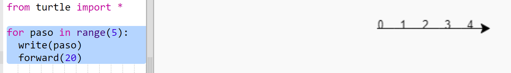
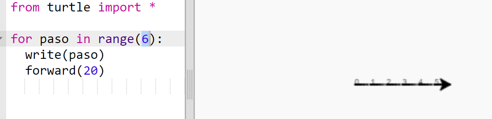
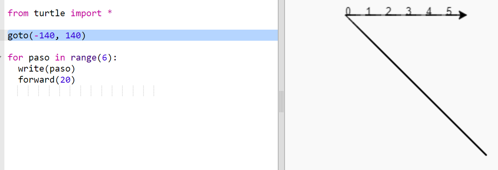
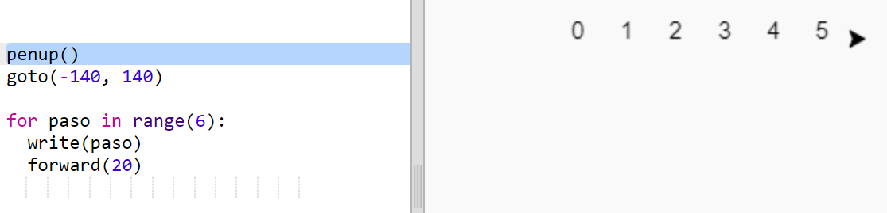
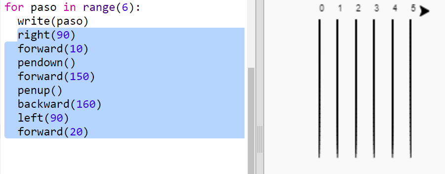
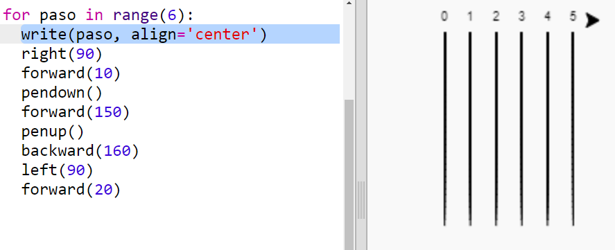

## Pista de carreras

Vas a crear un juego con carreras de tortugas. Primero necesitarán una pista de carreras.

+ Abre la plantilla Python en blanco en Trinket: <a href="http://jumpto.cc/python-new" target="_blank">jumpto.cc/python-new</a>.

+ Añade el siguiente código para dibujar una línea usando la 'tortuga':
    
    

+ Ahora vamos a usar la tortuga para dibujar algunas marcas de pista para la carrera.
    
    La función `write` de la tortuga escribe texto en la pantalla.
    
    Pruébalo:
    
    

+ Ahora necesitas completar los números intermedios para crear marcas:
    
    

+ ¿Te has dado cuenta de que tu código es muy repetitivo? Lo único que cambia es el número que se escribe.
    
    Hay una manera mejor de hacer esto en Python. Puedes usar un bucle `for`.
    
    Actualiza tu código para usar un bucke `for`:
    
    

+ Hmm, eso solo imprime números hasta el 4. En Python `range(5)` devuelve cinco números, de 0 a 4. Para que también devuelva el 5, deberás utilizar `range(6)`:
    
    

+ Ahora podemos dibujar algunas marcas de pista. La tortuga comienza en las coordenadas (0,0) en el centro de la pantalla.
    
    Mejor mueve la tortuga a la parte superior izquierda:
    
    

+ ¡Ah, querrás levantar primero el bolígrafo!
    
    

+ En lugar de dibujar una línea horizontal, dibujemos líneas verticales para crear una pista:
    
    
    
    `right(90)` hace que la tortuga gire a la derecha 90 grados (en ángulo recto). Moviendo `forward(10)` antes de dejar el lápiz, deja un pequeño espacio entre el número y el inicio de la línea. Después de dibujar la línea, levanta el lápiz y ve `backward(160)` la longitud de la línea más la separación.

+ Se ve mejor si centras los números:
    
    

+ Y puedes acelerar la tortuga para que se dibuje más rápido:
    
    