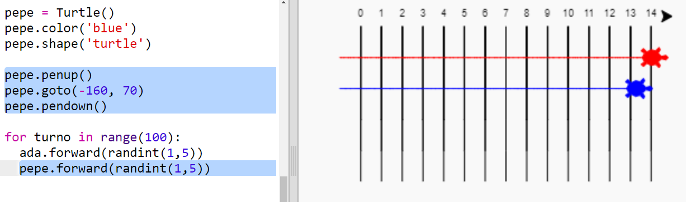

## Carreras de tortugas

Ahora a por la parte divertida. Añadamos algunas tortugas de carreras. Sería realmente aburrido si las tortugas hicieran lo mismo cada vez, así que se moverán un número aleatorio de pasos cada turno. El ganador es la tortuga que llega más lejos en 100 turnos.

+ Cuando usas comandos como `forward(20)` Estás usando una sola tortuga. Pero puedes crear más tortugas. Añade el siguiente código al final de tu script (pero asegúrate de que no tenga sangría):
    
    
    
    La primera línea crea una tortuga llamada 'ada'. Las siguientes líneas establecen el color y la forma de la tortuga. ¡Ahora realmente parece una tortuga!

+ Vamos a enviar a la tortuga a la línea de partida:
    
    

+ Ahora necesitas hacer que la tortuga se mueva un número aleatorio de pasos a la vez. Necesitarás la función `randint` de la librería de Python `random`. Añade esta línea `import` en la parte superior de tu script:
    
    

+ La función `randint` devuelve un entero aleatorio (número entero) entre los valores elegidos. La tortuga avanzará 1, 2, 3, 4 o 5 pasos en cada turno.
    
    

+ ¡Una tortuga no da para una gran carrera! Añadamos otra:
    
    
    
    Tenga en cuenta que el código para mover la tortuga azul debe estar en **el mismo** bucle `for` al igual que el código para mover la tortuga roja para que cada uno haga un movimiento en cada turno.