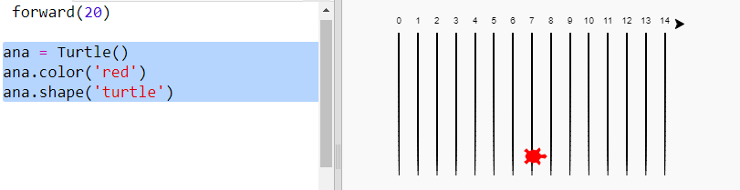
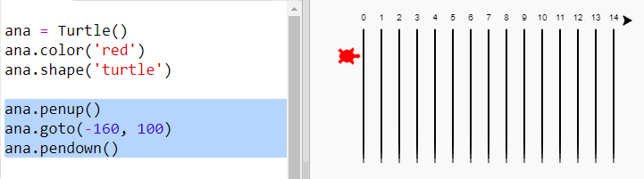
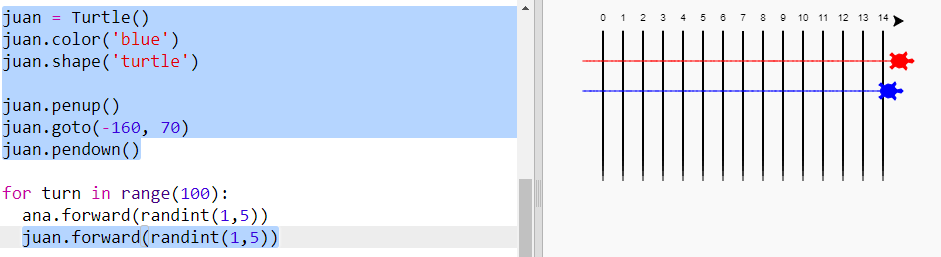

## Racing turtles

Now for the fun bit. Let's add some racing turtles. It would be really boring if the turtles did the same thing every time so they will move a random number of steps each turn. The winner is the turtle that gets the furthest in 100 turns.

+ When you use commands like `forward(20)` you are using a single turtle. But you can create more turtles. Add the following code to the end of your script (but make sure it's not indented):
    
    
    
    The first line creates a turtle called 'ada'. The next lines set the colour and shape of the turtle. Now it really looks like a turtle!

+ Let's send the turtle to the starting line:
    
    

+ Now you need to make the turtle race by moving a random number of steps at a time. You'll need the `randint` function from the Python `random` library. Add this `import` line to the top of your script:
    
    

+ The `randint` function returns a random integer (whole number) between the values chosen. The turtle will move forward 1, 2, 3, 4, or 5 steps at each turn.
    
    

+ One turtle isn't much of a race! Let's add another one:
    
    
    
    Note that the code for moving the blue turtle needs to be in **the same** `for` loop as the code for moving the red turtle so that they each make a move every turn.