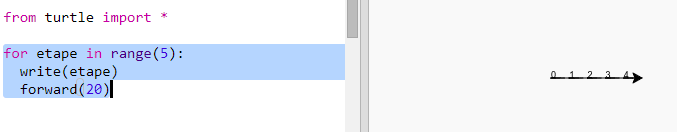
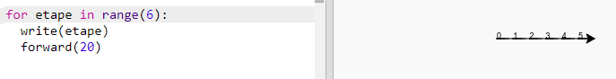
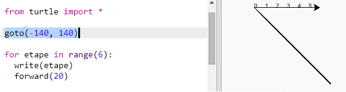
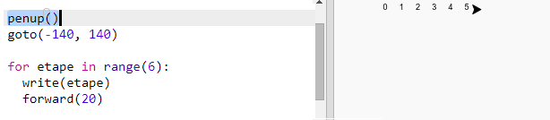
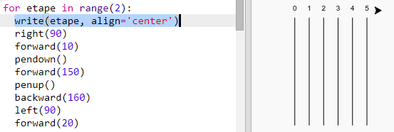

## Piste de course

Tu vas créer un jeu de course de tortues. Tout d'abord, elles auront besoin d'une piste de course.

+ Ouvre le modèle de Trinket Python: <a href="http://jumpto.cc/python-new" target="\_blank">jumpto.cc/python-new</a>.

+ Ajoute le code suivant pour dessiner une ligne en utilisant l'outil 'turtle' (tortue):

  

+ Maintenant, utilisons la tortue pour dessiner quelques marques pour la course.

  La fonction turtle `write` écrit du texte à l'écran.

  Essaie la:

  

+ Maintenant, tu dois entrer les nombres entre 0 et 5 pour créer les marques.

  

+ As-tu remarqué que ton code est très répétitif? La seule chose qui change est le nombre à écrire.

  Il y a une meilleure manière de faire ceci en Python. Tu peux utiliser une boucle `for`.

  Mets à jour ton code en utilisant une boucle `for`:

  

+ Hmm, ça n'écrit que les nombres jusqu'à 4. En Python, `range(5)` retourne cinque nombres, de 0 à 4. Pour aussi obtenir le 5, tu devras utiliser `range(6)`:

  

+ Maintenant nous pouvons dessiner quelques marques sur la piste. La tortue débute aux coordonnées (0, 0), au centre de l'écran.

  Déplace la tortue en haut à gauche à la place:

  

+ Ah, tu voudras d'abord lever le crayon! ('pen' et 'up' = 'penup')

  

+ Au lieu de dessiner une ligne horizontale, dessinons des lignes verticales pour créer une piste:

  

  `right(90)` fait tourner la tortue de 90 degrés à droite (un angle droit). Le déplacement `forward(10)` avant de baisser le crayon (`pendown()`) laisse un petit espace entre le nombre et le début de la ligne. Après avoir tracé la ligne, tu dois lever le crayon puis reculer de la longueur de la ligne plus la longueur de l'espace avec la commande `backward(160)`.

+ L'apparence est meilleure si tu centres les nombres:

  

+ Et tu peux accélérer la tortue pour qu'elle dessine plus rapidement:

  
