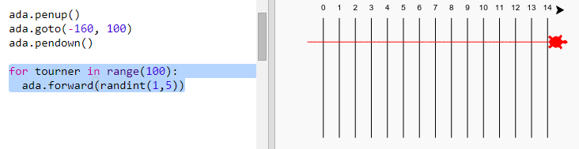
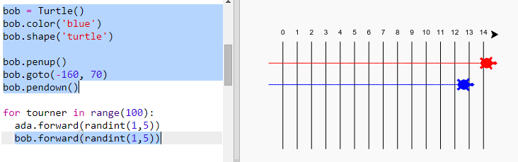

## Tortues de course

Maintenant pour le plaisir. Ajoutons des tortues de course. Ce serait vraiment ennuyeux que les tortues fassent la même chose à chaque fois pour pouvoir faire un nombre aléatoire de pas à chaque tour. Le gagnant est la tortue la plus éloignée en 100 tours.

+ Lorsque tu utilises des commandes telles que `forward(20)` tu utilises une seule tortue. Mais tu peux créer plus de tortues. Ajoute le code suivant à la fin de ton script (mais assure-toi qu'il ne soit pas en retrait):
    
    
    
    La première ligne crée une tortue appelée 'ada'. Les lignes suivantes définissent la couleur et la forme de la tortue. Maintenant, ça ressemble vraiment à une tortue!

+ Envoyons la tortue à la ligne de départ:
    
    

+ Maintenant, tu dois faire la course de tortue en déplaçant un nombre aléatoire de pas à la fois. Tu auras besoin de la fonction `randint` de la bibliothèque Python `random`. Ajoute cette ligne `import` en haut de ton script:
    
    

+ La fonction `randint` renvoie un entier aléatoire (nombre entier) entre les valeurs choisies. La tortue avancera de 1, 2, 3, 4 ou 5 pas à chaque tour.
    
    

+ Une tortue, ce n'est pas assez! Ajoutons-en une autre:
    
    
    
    Note que le code pour déplacer la tortue bleue doit être dans **la même** boucle `for` comme le code pour déplacer la tortue rouge afin qu’elles bougent à chaque tour.