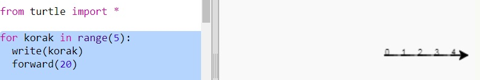
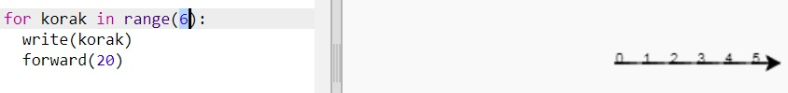
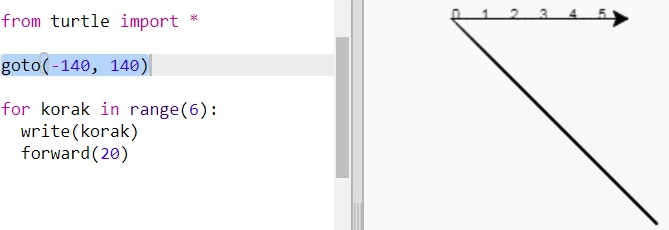
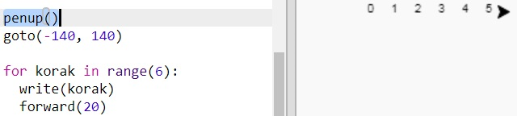
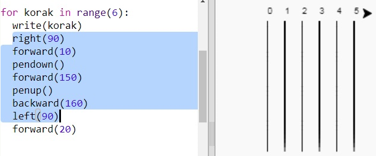
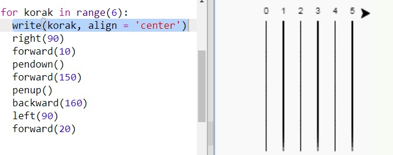

## Trkalište

Napravit ćeš igru u kojoj se utrkuju kornjače, ali prvo im treba trkalište.

+ Otvori prazan Python predložak u Trinketu: <a href="http://jumpto.cc/python-new" target="_blank">jumpto.cc/python-new</a>.

+ Dodaj sljedeći kôd za crtanje linije s 'kornjačom':
    
    

+ Nacrtajmo sada s kornjačom oznake trkališta za utrku.
    
    Naredba `write` ispisuje tekst na ekran.
    
    Pokušaj:
    
    

+ Sada moraš upisati brojeve između uglatih zagrada kako bi napravio oznake:
    
    

+ Primjećuješ li da se tvoj kôd poprilično ponavlja? Mijenjaju se jedino brojevi koje treba ispisati.
    
    U Pythonu postoji bolji način da ovo napraviš. Možeš koristiti `for` petlju.
    
    Izmijeni svoj kôd sa `for` petljom:
    
    

+ Hmm, program ispisuje samo brojeve do 4. U Pythonu, `range(5)` znači da će program ispisati 5 brojeva, od 0 do 4. Ako želiš da ispiše i broj 5, moraš koristiti `range(6)`:
    
    

+ Sada možemo nacrtati neke oznake trkališta. Kornjača kreće od koordinata (0,0) koje se nalaze na sredini ekrana.
    
    Pomakni kornjaču u gornji lijevi kut:
    
    

+ Ah, prvo moraš podignuti olovku!
    
    

+ Umjesto da nacrtamo trkalište pomoću horizontalnih linija, nacrtajmo ga pomoću vertikalnih:
    
    
    
    Naredbom `right(90)` kornjača se okrene udesno za 90 stupnjeva (pravi kut). Pomicanjem unaprijed naredbom `forward(10)` prije spuštanja olovke ostat će mala praznina između broja i početka linije. Nakon crtanja linije, podigni olovku. Naredbom `backward(160)` ići ćeš unatrag za duljinu linije i praznine.

+ Izgledat će urednije ako centriraš brojeve:
    
    

+ Također, možeš ubrzati kornjaču kako bi crtala brže:
    
    