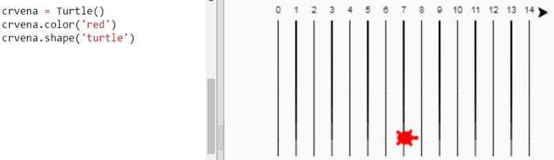
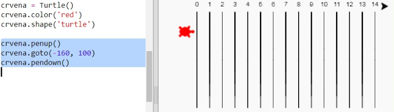
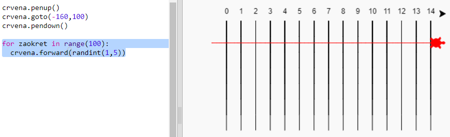
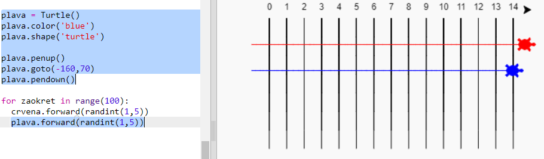

## Kornjače za utrku

A sada zabavni dio. Dodajmo nekoliko kornjača koje će se utrkivati. Bilo bi prilično dosadno kada bi kornjače svaki put radile istu stvar pa će se zato u svakom krugu pomicati za nasumični broj koraka. Pobjednik je ona kornjača koja se najdalje pomakne u 100 krugova.

+ Kad koristiš naredbe poput `forward(20)`, pomičeš samo jednu kornjaču. Ali, možeš napraviti više kornjača. Dodaj sljedeći kôd na kraju svog programa (pripazi da nije uvučen):
    
    
    
    Prva linija kôda stvara kornjaču koja se zove 'crvena'. Ostale linije određuju boju i oblik kornjače. Sada stvarno izgleda kao kornjača!

+ Pošaljimo kornjaču na startnu liniju:
    
    

+ Sada se kornjača mora utrkivati tako da se pomiče nasumičan broj koraka po stazi. Koristi funkciju `randint` iz Pythonove `random` biblioteke. Dodaj `import` liniju na početak programa:
    
    

+ Funkcija `randint` vraća nasumičan integer (cijeli broj) koji se nalazi između odabranih vrijednosti. Kornjača će se pomaknuti 1, 2, 3, 4 ili 5 koraka unaprijed u svakom krugu.
    
    

+ Za utrku nam nije dovoljna samo jedna kornjača! Dodajmo još jednu:
    
    
    
    Primijeti da se kôd za pomicanje plave kornjače mora nalaziti unutar **iste** `for` petlje kao i kôd za pomicanje crvene kornjače. Tako će se obje kornjače pomicati u svakom krugu.