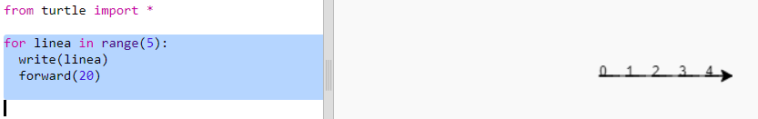
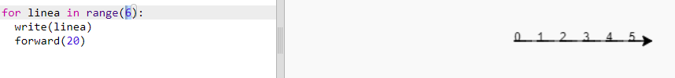
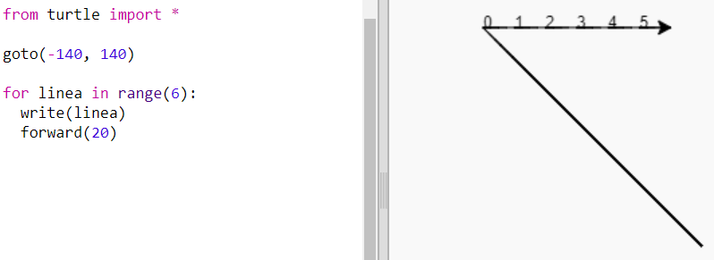
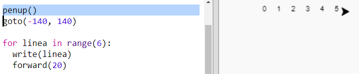
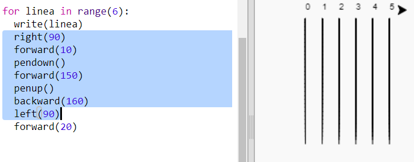
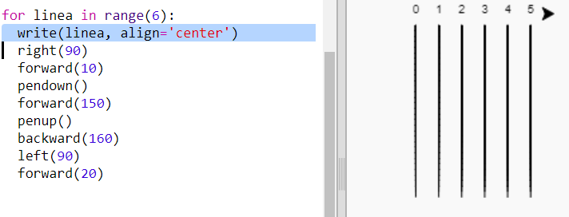

## Tracciato di gara

Stai per creare un gioco con tartarughe da corsa. Per prima cosa avranno bisogno di una pista.

+ Apri un modello vuoto di Python su Trinket: <a href="http://jumpto.cc/python-new" target="_blank">jumpto.cc/python-new</a>.

+ Aggiungi il seguente codice per tracciare una linea usando 'turtle':
    
    

+ Ora usiamo la tartaruga per disegnare alcuni segni della pista per la gara.
    
    La funzione `write` della tartaruga scrive del testo sullo schermo.
    
    Fai una prova:
    
    

+ Ora devi inserire i numeri in mezzo per creare i contrassegni:
    
    

+ Hai notato che il tuo codice è molto ripetitivo? L'unica cosa che cambia è il numero da scrivere.
    
    C'è un modo migliore per farlo in Python. Puoi usare un ciclo `for`.
    
    Aggiorna il tuo codice per usare un ciclo `for`:
    
    

+ Hmm, questo scrive solo numeri fino a 4. In Python `range(5)` dà in output cinque numeri, da 0 a 4. Per ottenere anche il 5 dovrai usare `range(6)`:
    
    

+ Ora possiamo disegnare qualche segno per delimitare il tracciato. La tartaruga inizia alle cordinate (0,0) al centro dello schermo.
    
    Spostala invece in alto a sinistra:
    
    

+ Ah, dovrai alzare la penna prima!
    
    

+ Invece di disegnare linee orizzontali, disegniamo linee verticali per creare un tracciato:
    
    
    
    `right(90)` fa girare la tartaruga a destra di 90 gradi (un angolo retto). Inserire `forward(10)` prima di abbassare la penna lascia un piccolo spazio tra il numero e l'inizio della linea. Dopo aver disegnato la linea alzerai la penna e andrei `backward(160)`, ovvero la lunghezza della linea più lo spazio.

+ Sembra più ordinato se allinei i numeri al centro:
    
    

+ E puoi anche far accelerare la tartaruga per farla disegnare più velocemente:
    
    