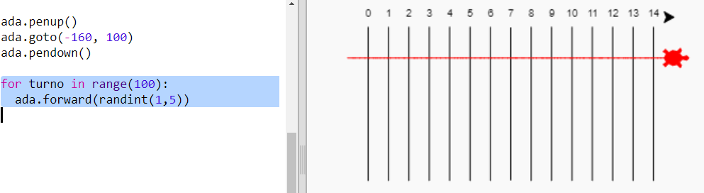
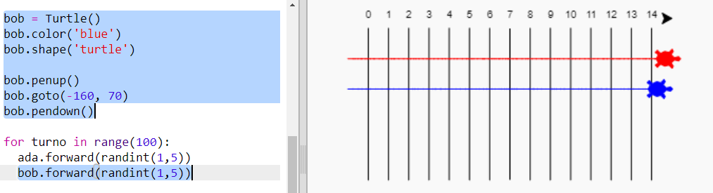

## Tartarughe in gara

Ora arriva la parte divertente. Aggiungiamo alcune tartarughe che gareggiano. Se le tartarughe facessero ogni volta la stessa cosa, sarebbe molto noioso, per cui in ogni turno si muoveranno un numero di passi a caso. Vince la tartaruga che arriva più lontana in 100 turni.

+ Quando usi comandi come 'forward(20)', stai usando una tartaruga singola. Ma puoi creare altre tartarughe. Aggiungi il seguente codice alla fine del tuo script (ma assicurati che non sia indentato):

  

  La prima linea crea una tartaruga chiamata 'ada'. Le prossime linee stabiliscono il colore e la forma della tartaruga. Ora sembra davvero una tartaruga!

+ Mandiamo la tartaruga alla linea iniziale:

  

+ Ora dovrai fare gareggiare la tartaruga muovendo un numero a caso di passi alla volta. Avrai bisogno della funzione 'randint' dalla libreria 'random' Python. + Aggiungi questa riga 'import' in cima al tuo script:

  

+ La funzione 'randint' restituisce un numero intero a caso tra i valori scelti. La tartaruga si muoverà avanti di 1, 2, 3, 4 o 5 passi per ogni turno.

  

+ Una tartaruga non è abbastanza per fare una gara! Aggiungiamone un'altra:

  

  Nota che il codice per muovere la tartaruga blu ha bisogno di essere nello_stesso_loop 'for' del codice per muovere la tartaruga rossa, in modo che ognuna di loro faccia un movimento per ogni turno.

