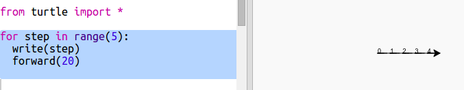
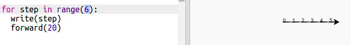
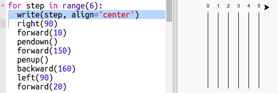

## ರೇಸ್ ಟ್ರ್ಯಾಕ್ (ಪಂದ್ಯದ ಹಾದಿ)

ರೇಸಿಂಗ್ ಆಮೆಗಳೊಂದಿಗೆ ನೀವು ಆಟವನ್ನು ರಚಿಸಲು ಹೊರಟಿದ್ದೀರಿ. ಮೊದಲು ಅವರಿಗೆ ರೇಸ್ ಟ್ರ್ಯಾಕ್ ಅಗತ್ಯವಿದೆ.

+ ಖಾಲಿ ಪೈಥಾನ್ ಟೆಂಪ್ಲೆಟ್ Trinket (ಟ್ರಿಂಕೆಟ್): <a href="http://jumpto.cc/python-new" target="_blank">jumpto.cc/python-new</a> ಅನ್ನು ತೆರೆಯಿರಿ.

+ 'turtle' ಬಳಸಿ ರೇಖೆಯನ್ನು ಸೆಳೆಯಲು ಈ ಕೆಳಗಿನ ಕೋಡ್ ಸೇರಿಸಿ:
    
    

+ ಈಗ ನಾವು 'turtle' ಅನ್ನು ಬಳಸಿ ಓಟದ ಪಥದ ನಿರ್ಮಾಣಕ್ಕಾಗಿ ಗುರುತುಗಳನ್ನು ಹಾಕೋಣ.
    
    ಆಮೆಯ `write` function ಪದಗಳನ್ನು screen ಮೇಲೆ ಮುದ್ರಿಸುತ್ತದೆ.
    
    ಪ್ರಯತ್ನಿಸಿ ನೋಡಿ:
    
    

+ ಗುರುತುಗಳನ್ನು ರಚಿಸಲು ಈಗ ನೀವು ನಡುವೆ ಸಂಖ್ಯೆಗಳನ್ನು ಭರ್ತಿ ಮಾಡಬೇಕಾಗಿದೆ:
    
    

+ ನಿಮ್ಮ ಕೋಡ್ ತುಂಬಾ ಪುನರಾವರ್ತಿತ ವಾಗಿದೆ ಎಂದು ನೀವು ಗಮನಿಸಿದ್ದೀರಾ? ಬದಲಾಗುವ ಏಕೈಕ ವಿಷಯವೆಂದರೆ ಬರೆಯಬೇಕಾದ ಸಂಖ್ಯೆ.
    
    ಪೈಥಾನ್ನಲ್ಲಿ ಇದನ್ನು ಮಾಡಲು ಉತ್ತಮ ಮಾರ್ಗವಿದೆ `for` loop ಅನ್ನು ಬಳಸಬಹುದು.
    
    `for` loop ಅನ್ನು ಬಳಸಲು ನಿಮ್ಮ ಕೋಡನ್ನು ನವೀಕರಿಸಿ:
    
    

+ ಓಹ್, ಅದು ಕೇವಲ 4 ರವರೆಗೆ ಸಂಖ್ಯೆಗಳನ್ನು ಮುದ್ರಿಸುತ್ತದೆ. Python ನಲ್ಲಿ `range(5)` 0 ರಿಂದ 4 ರವರೆಗೆ ಐದು ಸಂಖ್ಯೆಗಳನ್ನು ಹಿಂದಿರುಗಿಸುತ್ತದೆ. ಅದನ್ನು 5 ಹಿಂದಿರುಗಿಸಲು ನೀವು ಬಳಸಬೇಕಾಗುತ್ತದೆ `range(6)`:
    
    

+ ಈಗ ನಾವು ಕೆಲವು ಟ್ರ್ಯಾಕ್ ಗುರುತುಗಳನ್ನು ಸೆಳೆಯಬಹುದು. ಆಮೆ ಪ್ರಾರಂಭವಾಗುತ್ತದೆ coordinates (0,0) screen ಮಧ್ಯದಲ್ಲಿ.
    
    ಆಮೆಯ ಬದಲು ಮೇಲಿನ ಎಡಕ್ಕೆ ಸರಿಸಿ:
    
    

+ ಆಹ್, ನೀವು ಮೊದಲು ಪೆನ್ನನ್ನು ಮೇಲಕ್ಕೆತ್ತಲು ಬಯಸುತ್ತೀರಿ!
    
    

+ ಪಥವನ್ನು ರಚಿಸಲು ರೇಖೆಗಳನ್ನು ಅಡ್ಡವಾಗಿ ಬಿಡಿಸುವ ಬದಲು ಲಂಬವಾಗಿ ಬಿಡಿಸೋಣ:
    
    
    
    `right(90)` ಯು ಆಮೆಯನ್ನು 90 ಕೋನಗಳಿಗೆ ತಿರುಗಿಸುತ್ತದೆ (ಲಂಬ ಕೋನ). ಪೆನ್ ಕೆಳಗಿಡುವ ಮೊದಲು `forward(10)` ಉಪಯೋಗಿಸಿದರೆ ಸಂಖ್ಯೆ ಮತ್ತು ಪ್ರಾರಂಭದ ರೇಖೆ ನಡುವೆ ಸಣ್ಣ ಅಂತರವನ್ನು ಬಿಡುತ್ತದೆ. ರೇಖೆಯನ್ನು ಚಿತ್ರಿಸಿದ ನಂತರ ಪೆನ್ನನ್ನು ಮೇಲಕೆತ್ತಿ ಹಿಂದಿರುಗಲು `backward(160)` ,ಅಂದರೆ ರೇಖೆ ಮತ್ತು ಅಂತರದ ಮೊತ್ತ.

+ ನೀವು ಸಂಖ್ಯೆಯನ್ನು ಮಧ್ಯದಲ್ಲಿ ಇರಿಸಿದರೆ ಅದು ಅಚ್ಚುಕಟ್ಟಾಗಿ ಕಾಣುತ್ತದೆ:
    
    

+ ಮತ್ತು ನೀವು ಆಮೆಯನ್ನು ವೇಗಗೊಳಿಸಬಹುದು ಆದ್ದರಿಂದ ಅದು ವೇಗವಾಗಿ ಸೆಳೆಯುತ್ತದೆ:
    
    