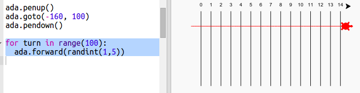

## ರೇಸಿಂಗ್ ಆಮೆಗಳು

ಈಗ ಮೋಜನ್ನು ಹೆಚ್ಚಿಸಲು. ಇನ್ನಷ್ಟು ಆಮೆಗಳನ್ನು ಸೇರಿಸೋಣ. ಆಮೆಗಳು ಪ್ರತಿಬಾರಿಯೂ ಅದೇ ಕೆಲಸವನ್ನು ಮಾಡಿದರೆ ಅದು ನಿಜವಾಗಿಯೂ ಬೇಸರ ಹುಟ್ಟಿಸುತ್ತದೆ ಆದ್ದರಿಂದ ಅವು ಪ್ರತಿಬಾರಿಯೂ ಅನಿಶ್ಚಿತ ಸಂಖ್ಯೆಯಷ್ಟು ಚಲಿಸುತ್ತದೆ. 100 ಸರದಿಗಳಲ್ಲಿ ಹೆಚ್ಚಿನ ಸಂಖ್ಯೆ ಚಲಿಸಿದ ಆಮೆಯು ವಿಜೇತ ವಾಗುತ್ತದೆ.

+ ನೀವು `forward(20)` ನಂತಹ commands ಬಳಸುವಾಗ ಒಂದೇ ಆಮೆಯನ್ನು ಬಳಸುತ್ತಿರುವಿರಿ. ಆದರೆ ನೀವು ಹೆಚ್ಚು ಆಮೆಗಳನ್ನು ರಚಿಸಬಹುದು. ನಿಮ್ಮ ಸ್ಕ್ರಿಪ್ಟ್‌ನ (script) ಕೊನೆಯಲ್ಲಿ ಈ ಕೆಳಗಿನ ಕೋಡ್(code) ಸೇರಿಸಿ (ಆದರೆ ಅದನ್ನು ಉದ್ದೇಶಿಸಿಲ್ಲ ಎಂದು ಖಚಿತಪಡಿಸಿಕೊಳ್ಳಿ):
    
    
    
    ಮೊದಲನೆಯ ಸಾಲು 'ada' ಎಂಬ ಆಮೆಯನ್ನು ರಚಿಸುತ್ತದೆ ಇನ್ನುಳಿದ ಸಾಲುಗಳು ಆಮೆಯ ಬಣ್ಣ ಮತ್ತು ಗಾತ್ರಗಳನ್ನು ರಚಿಸುತ್ತದೆ, ಈಗ ಅದು ನಿಜವಾಗಿಯೂ ಆಮೆಯ ತರಹ ಕಾಣುತ್ತದೆ!

+ ಈಗ ಆಮೆಯನ್ನು ಪ್ರಾರಂಭದ ಗೆರೆಯ ಹತ್ತಿರ ಕಳುಹಿಸೋಣ:
    
    

+ ಈಗ ನೀವು ಒಂದು ಸಮಯದಲ್ಲಿ ಯಾದೃಚ್ number ಿಕ ಸಂಖ್ಯೆಯ ಹಂತಗಳನ್ನು ಚಲಿಸುವ ಮೂಲಕ ಆಮೆ ಓಟವನ್ನು ಮಾಡಬೇಕಾಗಿದೆ. ನಿಮಗೆ ಅಗತ್ಯವಿದೆ `randint` function ಇಂದ Python `random` library. ಅದಕ್ಕೆ `import` ಸಾಲನ್ನು ನಿಮ್ಮ ಸ್ಕ್ರಿಪ್ಟಿನ ಮೇಲ್ಭಾಗಕ್ಕೆ ಸೇರಿಸಿ:
    
    

+ `randint` function ಆಯ್ಕೆ ಮಾಡಿದ ಮೌಲ್ಯಂಕ ಗಳ ನಡುವೆ ಅನಿಶ್ಚಿತ ಪೂರ್ಣಾಂಕವನ್ನು ಹಿಂದಿರುಗಿಸುತ್ತದೆ. ಪ್ರತಿ ಸರದಿಯಲ್ಲಿ ಆಮೆಯು 1,2,3,4 ಅಥವಾ 5 ಹೆಜ್ಜೆಗಳನ್ನು ಮುಂದಿಡುತ್ತದೆ.
    
    

+ ಸ್ಪರ್ಧೆ ಮಾಡಲು ಒಂದು ಆಮೆ ಸಾಕಾಗುವುದಿಲ್ಲ ಇನ್ನಷ್ಟು ಆಮೆಗಳನ್ನು ಸೇರಿಸೋಣ:
    
    
    
    ನೀಲಿ(blue) ಆಮೆ ಚಲಿಸುವ ಕೋಡ್ ಅನ್ನು ಒಳಗೊಂಡಿರಬೇಕು ಎಂಬುದನ್ನು ಗಮನಿಸಿ **ಒಂದೇ** `for` ಲೂಪ್ ಮಾಡಿ ಕೆಂಪು(red) ಆಮೆ ಚಲಿಸುವ ಸಂಕೇತವಾಗಿ, ಇದರಿಂದ ಅವುಗಳು ಪ್ರತಿಯೊಂದೂ ಪ್ರತಿ ತಿರುವಿನಲ್ಲಿ ಚಲಿಸುತ್ತವೆ.
