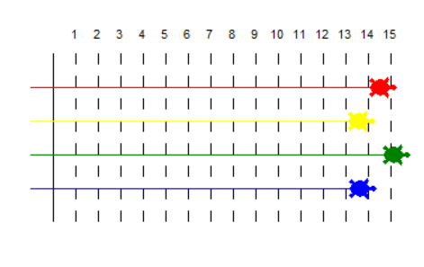

## 소개

반복문을 사용해 경주 트랙을 그리고 거북이 경주게임을 만들어 봅시다.

### 만들 작품

이 프로젝트에서는 거북이가 경주를 하는 게임을 만들어 보면서 반복문 사용법에 대해 익히게 됩니다. 반복문은 경주 트랙을 만들거나 매 턴마다 거북이를 랜덤한 거리만큼 움직이는데 사용됩니다. 만약 팀으로 게임을 진행한다면, 팀원 별로 거북이를 하나씩 선택하고, 가장 멀리간 거북이의 팀이 우승자가 됩니다.

  <iframe src="https://trinket.io/embed/python/9339862606?outputOnly=true&start=result" width="600" height="500" frameborder="0" marginwidth="0" marginheight="0" allowfullscreen>
  </iframe>
  

### 배울 내용

거북이 경주 게임을 만들어 보며 아래와 같은 내용을 배우게 됩니다.

+ 파이썬에서 `for` 반복문 작성방법
+ 파이썬에서 난수(랜덤한 숫자)를 사용하는 방법
+ 각 거북이별로 다른 색상의 선 그리기

This project covers elements from the following strands of the [Raspberry Pi Digital Making Curriculum](https://rpf.io/curriculum){:target="_blank"}:

+ [ 기본 프로그래밍 구조를 사용하여 간단한 프로그램 작성 ](https://www.raspberrypi.org/curriculum/programming/creator/) {: target = "_ blank"}

### 교육자를 위한 추가 정보

이 프로젝트를 인쇄하려면 [프린트용 버전](https://projects.raspberrypi.org/en/projects/turtle-race/print){:target="_blank"}을 사용하십시오.

하단의 링크를 사용하여 이 프로젝트의 GitHub 저장소에 접속합니다. 모든 리소스 (완성된 프로젝트 예제를 포함) 가 'en/resources' 폴더에 들어 있습니다.