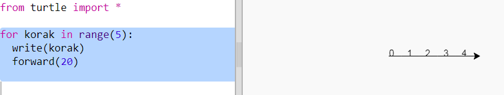
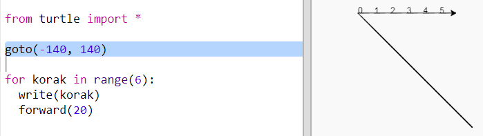
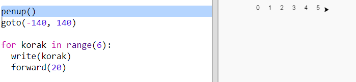
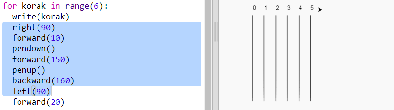
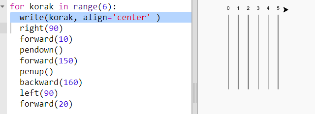

## Trkalište

Napravićeš igru u kojoj se trkaju kornjače. Za to će im prvo trebati trkalište.

+ Otvori prazan Python šablon u Trinketu: <a href="http://jumpto.cc/python-new" target="_blank">jumpto.cc/python-new</a>.

+ Dodaj sljedeći kôd za crtanje linije koristeći 'kornjaču' (turtle):
    
    

+ Sada, koristeći kornjaču, nacrtajmo oznake trkališta.
    
    Funkcija `write` ispisuje tekst na ekranu.
    
    Isprobaj:
    
    

+ Sada treba da upišeš brojeve kako bi napravio/napravila oznake:
    
    

+ Primjećuješ li da se tvoj kôd u velikoj mjeri ponavlja? Mijenjaju se jedino brojevi koje treba upisati.
    
    U Pythonu postoji bolji način da to napraviš. Možeš da koristiš `for` petlju.
    
    Izmijeni svoj kôd koristeći `for` petlju:
    
    

+ Hm, ovo ispisuje samo brojeve do 4. U Pythonu, `range(5)` daje pet brojeva, od 0 do 4. Ako želiš da ispiše i broj 5, moraš da koristiš `range(6)`:
    
    

+ Sada možemo da nacrtamo oznake trkališta. Kornjača počinje od koordinata (0,0) koje se nalaze na sredini ekrana.
    
    Pomjeri kornjaču u gornji lijevi ugao:
    
    

+ Ah, prvo moraš da podigneš olovku!
    
    

+ Umjesto da crtamo liniju horizontalno, nacrtajmo trkalište pomoću vertikalnih linija:
    
    
    
    Naredbom `right(90)` kornjača će okreće udesno za 90 stepeni (pravi ugao). Pomjeranjem naprijed pomoću naredbe `forward(10)` prije spuštanja olovke ostaje mala praznina između broja i početka linije. Nakon što nacrtaš liniju, podigni olovku i koristi `backward(160)` da ideš unazad za dužinu linije i praznine.

+ Izgledaće urednije ako centriraš brojeve:
    
    

+ Takođe, možeš da ubrzaš kornjaču kako bi brže crtala:
    
    