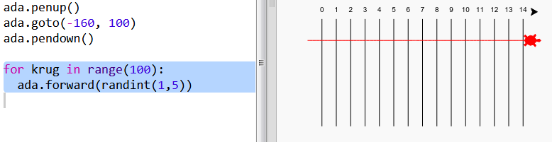
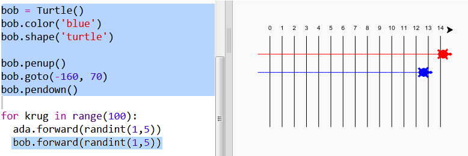

## Kornjače za trku

Sada dolazi zabavni dio. Dodajmo nekoliko kornjača za trku. Bilo bi zaista dosadno kada bi kornjače svaki put radile istu stvar, pa će se zato u svakom krugu pomjerati nasumičan broj koraka. Pobjednik je kornjača koja stigne najdalje u 100 krugova.

+ Kada koristiš naredbe kao što je `forward(20)`, koristiš samo jednu kornjaču. Ali, možeš da napraviš više kornjača. Dodaj sljedeći kôd na kraju svoje skripte (vodi računa da nije uvučen):
    
    
    
    Prvi red kreira kornjaču koja se zove 'ada'. Sljedeći redovi određuju boju i oblik kornjače. Sada stvarno izgleda kao kornjača!

+ Pošaljimo kornjaču na startnu liniju:
    
    

+ Sada treba da napraviš da kornjača trči tako što će se svaki put pomjerati nasumičan broj koraka. Potrebna ti je funkcija `randint` iz Pythonove `random` biblioteke. Dodaj ovaj `import` red na početak svoje skripte:
    
    

+ Funkcija `randint` vraća slučajan integer (cijeli broj) koji se nalazi između odabranih vrijednosti. Kornjača će se kretati naprijed 1, 2, 3, 4 ili 5 koraka u svakom krugu.
    
    

+ Jedna kornjača nije dovoljna za trku! Dodajmo još jednu:
    
    
    
    Imaj u vidu da kôd za pomjeranje plave kornjače mora da se nalazi u **istoj** `for` petlji u kojoj je kôd za pomjeranje crvene kornjače, tako da se obje kornjače pomjeraju u svakom krugu.