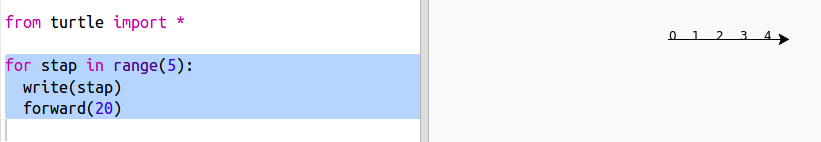
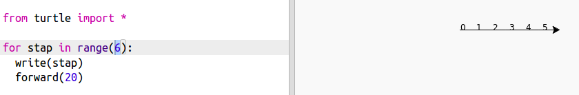
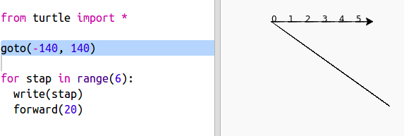
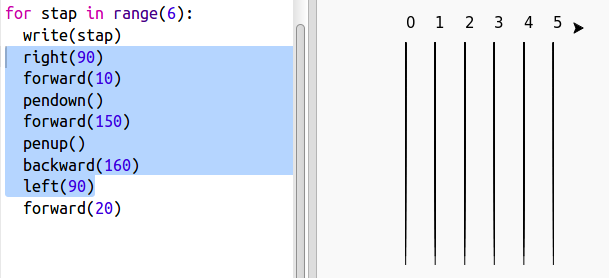
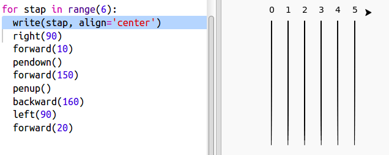

## Racebaan

Je gaat een spel maken met raceschildpadden. Eerst hebben ze een racebaan nodig.

+ Open de lege Python-sjabloon Trinket: <a href="http://jumpto.cc/python-new" target="_blank">jumpto.cc/python-new</a>.

+ Voeg de volgende code toe om een ​​lijn te tekenen met de 'turtle" (schildpad):
    
    

+ Laten we nu de schildpad gebruiken om de baanmarkeringen voor de race te tekenen.
    
    De turtle `write` functie schrijft tekst naar het scherm.
    
    Probeer het uit:
    
    

+ Nu moet je erin de getallen invullen om de markeringen aan te brengen:
    
    

+ Is het je opgevallen dat je code steeds weer herhaald wordt? Het enige dat verandert, is het aantal dat moet worden geschreven.
    
    Er is een betere manier om dit in Python te doen. U kunt een `for` lus gebruiken.
    
    Werk je code bij door een​​ `for` lus te gebruiken:
    
    

+ Hmm, dat drukt alleen getallen tot 4 af. `range(5) ` geeft In Python vijf getallen terug, van 0 tot en met 4. Om ook 5 terug te krijgen, moet je `range(6)` gebruiken:
    
    

+ Nu kunnen we wat baanmarkeringen tekenen. De schildpad begint op coördinaten (0,0) in het midden van het scherm.
    
    Beweeg de schildpad in plaats daarvan naar linksboven:
    
    

+ Ah, je moet eerst de pen optillen!
    
    

+ In plaats van een lijn horizontaal te tekenen, tekenen we verticale lijnen om een ​​track te maken:
    
    
    
    `right(90)` zorgt ervoor dat de schildpad een hoek van 90 graden rechtsom (een rechte hoek) maakt. Een `forward(10)` beweging voordat de pen naar beneden wordt geplaatst, laat een kleine opening tussen het nummer en het begin van de lijn ontstaan. Nadat je de lijn hebt getekend, til je de pen op en ga je `backward(160)` (achteruit) over de lengte van de lijn plus de tussenruimte.

+ Het ziet er netter uit als je de cijfers centreert:
    
    

+ En je kunt de schildpad versnellen zodat hij sneller tekent:
    
    