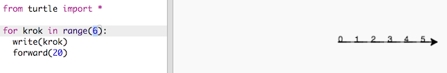
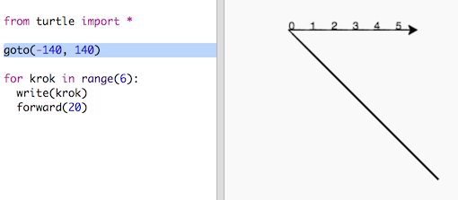
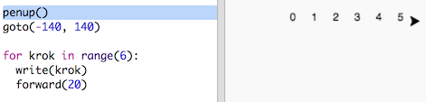
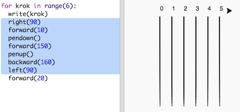
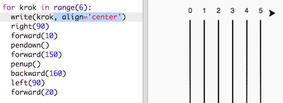

## Tor wyścigowy

Będziesz tworzyć grę ze ścigającymi się żółwiami. Zaczniemy od stworzenia dla nich toru wyścigowego.

+ Otwórz pusty szablon dla języka Python w edytorze Trinket: <a href="http://jumpto.cc/python-new" target="_blank">jumpto.cc/python-new</a>.

+ Dodaj następujący kod, aby narysować linię za pomocą "żółwia":
    
    

+ Teraz użyjmy żółwia, aby narysować tor wyścigowy.
    
    Funkcja `write` zapisuje tekst na ekranie.
    
    Wypróbuj:
    
    

+ Teraz musisz wpisać liczby, aby utworzyć oznaczenia:
    
    

+ Czy zauważyłeś, że twój kod jest bardzo powtarzalny? Jedyne, co się zmienia, to liczba, którą żółw zapisuje na ekranie.
    
    W Pythonie jest lepszy sposób na to, aby zapisać taki powtarzający się kod. Możesz użyć pętli `for`.
    
    Zmień swój kod używając pętli `for`:
    
    

+ Hmm, to wypisuje liczby tylko do 4. W Pythonie `range(5)` zwraca pięć liczb, od 0 do 4. Aby zwrócić także 5 musisz użyć `range(6)`:
    
    

+ Teraz możemy narysować tor. Żółw zaczyna od współrzędnych (0,0) na środku ekranu.
    
    Przesuń żółwia w lewy górny róg:
    
    

+ Ach, najpierw trzeba będzie podnieść pisak!
    
    

+ Zamiast rysować poziomą linię, narysujmy linie pionowe, aby stworzyć tor:
    
    
    
    `right(90)` powoduje, że żółw skręca w prawo o 90 stopni (kąt prosty). Poruszanie się do przodu (`forward(10)`) przed przyłożeniem pisaka pozostawia niewielką przerwę między liczbą a początkiem linii. Po narysowaniu linii podnieś pisak i przesuń do tyłu o długość linii plus przerwa (`backward(160)`).

+ Będzie lepiej wyglądać, jeśli wyśrodkujesz liczby:
    
    

+ Możesz też przyspieszyć żółwia, aby rysował szybciej:
    
    