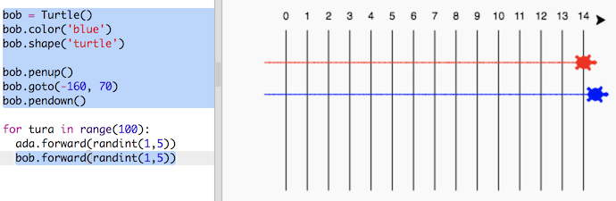

## Wyścigi żółwi

A teraz najważniejsza część gry. Dodajmy kilka wyścigowych żółwi. Gra będzie naprawdę nudna, jeśli żółwie będą robić to samo za każdym razem, więc będziemy przesuwać je o losową liczbę kroków w każdej turze. Zwycięzcą będzie żółw, który dotrze najdalej po 100 turach.

+ Kiedy używasz poleceń takich jak `forward(20)`, używasz pojedynczego żółwia. Możesz jednak stworzyć więcej żółwi. Dodaj następujący kod na końcu skryptu (ale upewnij się, że nie jest wcięty):
    
    
    
    Pierwsza linia tworzy żółwia o nazwie "ada". Następne wiersze określają kolor i kształt żółwia. Teraz naprawdę wygląda jak żółw!

+ Ustawmy żółwia na linii startowej:
    
    

+ Teraz musisz zrobić wyścig, przesuwając żółwia o losową liczbę kroków. Będziesz potrzebować funkcji `randint` z biblioteki Pythona o nazwie `random`. Dodaj linię z instrukcją `import` na początku skryptu:
    
    

+ Funkcja `randint` zwraca losową liczbę całkowitą (ang. integer) między wybranymi wartościami. Żółw przesunie się o 1, 2, 3, 4 lub 5 kroków w każdej turze.
    
    

+ Wyścigi z jednym żółwiem to nie wyścigi! Dodajmy jeszcze jednego:
    
    
    
    Zauważ, że kod do przesuwania niebieskiego żółwia musi być w **tej samej** pętli `for`, co kod do przesuwania czerwonego żółwia, tak aby każdy wykonał ruch w danej turze.