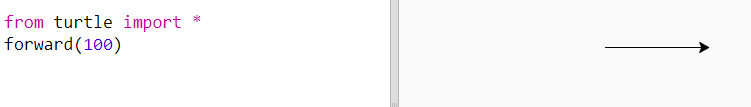
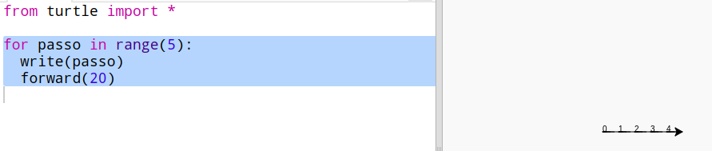
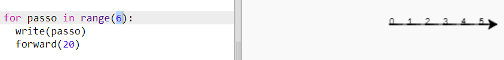
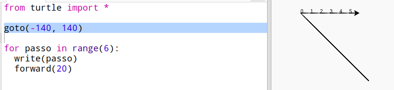
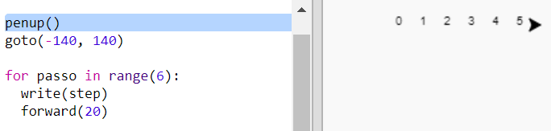
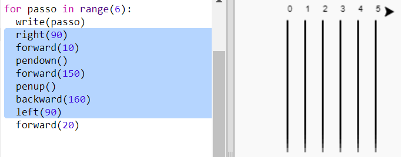
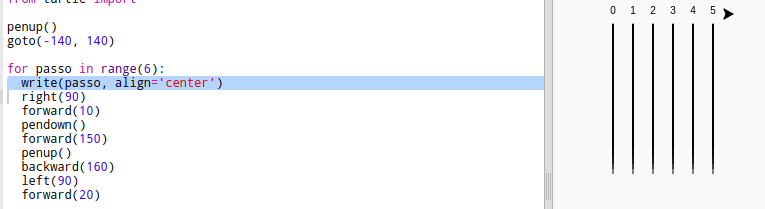

## Pista de corrida

Você vai criar um jogo com as tartarugas de corrida. Primeiro eles precisam de uma pista de corrida.

+ No Trinket abra um modelo em branco do Python: <a href="http://jumpto.cc/python-new" target="_blank">jumpto.cc/python-new</a>.

+ Adicione o seguinte código para desenhar uma linha usando a 'tartaruga':
    
    

+ Agora vamos usar a tartaruga para desenhar algumas marcas para a corrida.
    
    A tartaruga `escreve` função escreve texto na tela.
    
    Tente:
    
    

+ Agora você precisa preencher os números para criar marcações:
    
    

+ Você notou que seu código é muito repetitivo? A única coisa que muda é o número a ser escrito.
    
    Existe uma maneira melhor de fazer isso em Python. Você pode usar um `para o loop`.
    
    Atualize seu código para usar um loop `para`:
    
    

+ Hmm, isso só imprime números até 4. No Python `, o intervalo (5)` retorna cinco números, de 0 a 4. Para que ele também retorne 5, você precisará usar o intervalo `(6)`:
    
    

+ Agora podemos desenhar algumas marcas de pista. A tartaruga começa nas coordenadas (0,0) no meio da tela.
    
    Mova a tartaruga para o canto superior esquerdo:
    
    

+ Ah, você vai querer levantar a caneta primeiro!
    
    

+ Em vez de desenhar uma linha horizontalmente, vamos desenhar linhas verticais para criar uma trilha:
    
    
    
    `direita (90)` faz com que a tartaruga vire à direita 90 graus (um ângulo reto). Movendo `para frente (10)` antes de colocar a caneta no chão, há um pequeno espaço entre o número e o início da linha. After drawing the line you lift up the pen and go `backward(160)` the length of the line plus the gap.

+ Parece mais simples se você centralizar os números:
    
    

+ E você pode acelerar a tartaruga para que ela seja mais rápida:
    
    