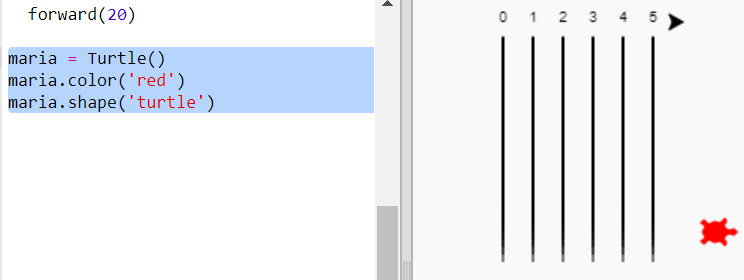
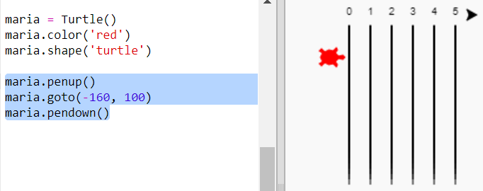
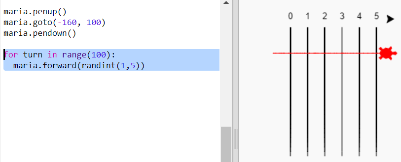
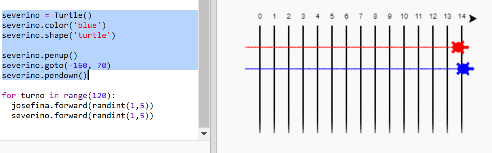

## Colocando as tartarugas para apostar corrida

Agora, a parte divertida. Vamos adicionar algumas tartarugas de corrida. Seria muito chato se as tartarugas fizessem a mesma coisa todas as vezes, então elas moverão um número aleatório de passos a cada volta. O vencedor é a tartaruga que chegar mais longe em 100 voltas.

+ Quando você usa comandos como `forward(20)` você está usando uma única tartaruga. Mas você pode criar mais tartarugas. Adicione o seguinte código ao final do seu script (mas certifique-se de que não fique recuado):
    
    
    
    A primeira linha cria uma tartaruga chamada 'ada'. As próximas linhas definem a cor e a forma da tartaruga. Agora parece mesmo uma tartaruga!

+ Vamos mandar a tartaruga para a linha de partida:
    
    

+ Agora você precisa fazer a corrida das tartarugas movendo um número aleatório de passos por vez. Você precisará da função `randint` da biblioteca Python `random`. Adicione esta linha `import` ao topo do seu script:
    
    

+ A função `randint` retorna um inteiro aleatório (número inteiro) entre os valores escolhidos. A tartaruga irá avançar 1, 2, 3, 4 ou 5 passos em cada volta.
    
    

+ Uma tartaruga não basta para uma corrida! Vamos adicionar outra:
    
    
    
    Observe que o código para mover a tartaruga azul precisa estar **no mesmo** laço `for` como o código para mover a tartaruga vermelha, para que cada uma faça um movimento a cada volta.