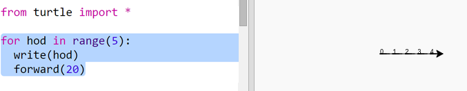
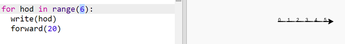
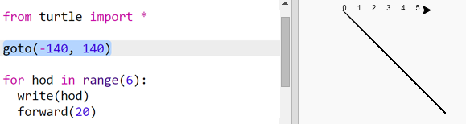
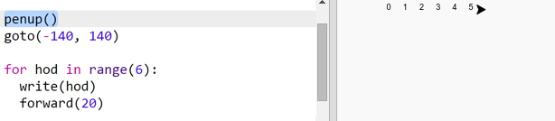
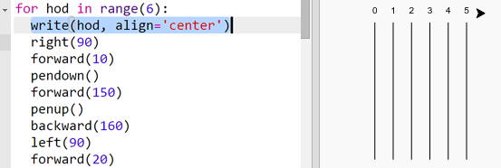

## Гоночная трасса

Тебе предлагается создать игру с гоночными черепахами. Для начала им понадобится гоночная трасса.

+ Открой пустой шаблон trinket для Python: <a href="http://jumpto.cc/python-new" target="_blank">jumpto.cc/python-new</a>.

+ Добавь следующий код, чтобы нарисовать линию, используя «черепашку» (turtle):
    
    

+ Теперь же давай используем черепашку, чтобы нарисовать размеченную трассу (трассу с пометками).
    
    Функция черепашки `write` выводит текст на экран.
    
    Попробуй:
    
    

+ Теперь ты можешь заполнить промежутки числами для создания маркировки:
    
    

+ Заметил ли ты, что твой код часто повторяется? Единственное, что меняется, это число для вывода.
    
    В Python есть лучший способ сделать то же самое. Ты можешь использовать цикл `for`.
    
    Перепиши код, чтобы везде использовался цикл `for`:
    
    

+ Хм, в этот раз печатается только числа до 4. В Python `range(5)` возвращает пять чисел, от 0 до 4 (range переводится как диапазон). Чтобы получить также 5, тебе нужно использовать диапазон `range(6)`:
    
    

+ Теперь мы можем нарисовать несколько дорожных меток. Черепашка начинает с координат (0,0) в середине экрана.
    
    Вместо этого перемести черепашку в верхний левый угол:
    
    

+ Ах, тебе понадобится сначала поднять ручку!
    
    

+ Вместо того, чтобы рисовать линию по горизонтали, давай нарисуем вертикальные линии, чтобы создать беговую дорожку:
    
    
    
    `right(90)` заставляет черепашку повернуть вправо на 90 градусов (на прямой угол). Перемещение `forward(10)` (т.е. вперёд на 10) перед тем, как опустить ручку, оставляет небольшой отступ между числом и началом линии. Когда линия нарисована, ты поднимаешь ручку и переходишь `backward(160)` (т.е. назад на 160) — это длина линии плюс отступ.

+ Выглядит немного лучше, если отцентрировать числа:
    
    

+ И ты также можешь ускорить черепашку, чтобы отрисовка проходила быстрее:
    
    