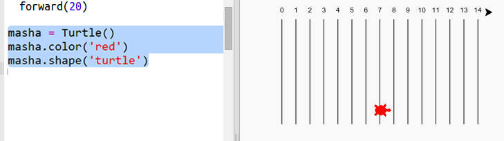
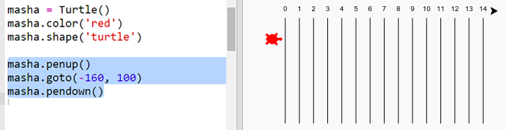
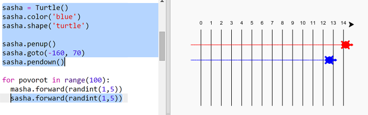

## Черепахи гонщики

Время немного позабавиться. Давай добавит несколько гоночных черепашек. Было бы очень скучно, если черепашки совершали одни и те же действия каждый раз, так что пусть за каждую итерацию (за каждый проход цикла) каждая из черепашек делает случайное число шагов. Победителем будет назначена черепашка, прошедшая дальше всех за 100 итераций (100 проходов цикла).

+ Когда ты используешь команды вроде `forward(20)`, ты командуешь одной черепашкой. Но ты можешь создать больше черепах. Добавь следующий код в конец скрипта (убедись, что он добавится без отступа):
    
    
    
    Первая строка создает черепашку под названием «Ада». Следующие строки устанавливают цвет и форму черепашки. Теперь это действительно похоже на черепашку!

+ Давай отправим черепашку на стартовую линию:
    
    

+ Теперь нужно научить черепаху передвигаться, делая случайное количество шагов за раз. Тебе понадобится функция `randint` (от random integer, т.е. случайное целое) из библиотеки `random` в Python. Добавь эту строку с `import` в верхнюю часть твоего скрипта:
    
    

+ Функция `randint` возвращает случайное целое число в диапазоне между указанными значениями. Черепашка будет двигаться вперёд на 1, 2, 3, 4, или 5 шага за каждую итерацию (т.е. проход цикла).
    
    

+ Не так уж много у нас черепах для гонки! Давай добавим ещё одну:
    
    
    
    Заметь, что код для перемещения синей черепашки должен располагаться в **том же** цикле `for`, что и код для перемещения красной черепашки, чтобы каждая из них передвигалась на каждой итерации.