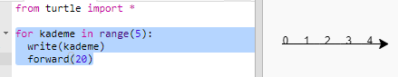
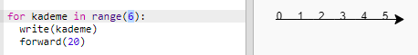
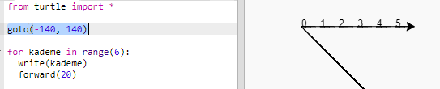
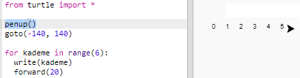
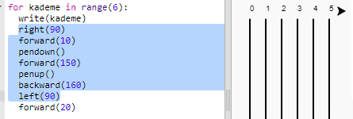
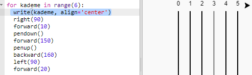

## Yarış Pisti

Kağlumbağaların yarıştığı bir oyun yaratacaksın. Bunun için ilk önce bir yarış pistine ihtiyaçları var.

+ Trinket'ta boş Python şablonunu açın: <a href="http://jumpto.cc/python-new" target="_blank">jumpto.cc/python-new</a>.

+ 'Turtle' modülünü kullanarak bir çizgi çizmek için aşağıdaki kodu ekleyin:
    
    

+ Şimdi turtle modülünü yarış pistine biraz şerit izi çizmek için kullanalım.
    
    Turtle modülünün `write` işlevi ekrana metin yazar.
    
    Deneyin:
    
    

+ Şimdi şerit izleri oluşturmak için aradaki sayıları doldurmanız gerekiyor:
    
    

+ Kodunuzun çok fazla tekrar ettiğini fark ettiniz mi? Kodların içinde değişen tek şey yazılan sayı.
    
    Bunu Python'da yapmanın daha iyi bir yolu var. Döngüler için `for` işlevini kullanabilirsiniz.
    
    Kodunuzu `for` döngüsü kullanarak güncelleyin:
    
    

+ Hmm, bu yalnızca 4'e kadar olan sayıları yazdırıyor. Python `range(5)` işlevi 0'dan 4'e kadar beş rakam oluşturuyor. 5'e kadar olan sayıları yazdırmasını sağlamak için `range(6)` şeklinde kullanmanız gerekir:
    
    

+ Şimdi bazı şerit çizgileri çizebiliriz. Python turtle modülü ekranın ortasındaki (0,0) konumundan başlar.
    
    Bunun yerine turtle modülünü sol üst köşeye getirin:
    
    

+ Ah, ama önce kalemi kaldırmak isteyebilirsin!
    
    

+ Yatay bir çizgi çizmek yerine, pisti oluşturmak için dikey çizgiler çizelim:
    
    
    
    `right(90)` kaplumbağanın 90 derece sağa dönmesini sağlar (dik açı). `forward(10)` kalemi yere koymadan önce sayı ile çizginin başlangıcı arasında küçük bir boşluk bırakır. Çizgiyi çizdikten sonra kalemi kaldırır ve `backward(160)` komutuyla çizginin ve boşluğun uzunluğu kadar geriye doğru alırsınız.

+ Sayıları ortalarsanız daha temiz görünür:
    
    

+ Ayrıca daha hızlı çizmesi için Turtle modülünü hızlandırabiirsiniz:
    
    