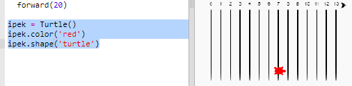
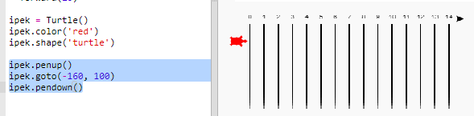

## Yarışan kaplumbağalar

Şimdi eğlence zamanı. Hadi biraz daha kaplumbağa ekleyelim. Kaplumbağaların her seferinde aynı şeyi yapmaları çok sıkıcı olurdu, bu yüzden her turda rastgele adımlarla ilerleyecekler. Kazanan, 100 turda en uzağa giden kaplumbağa olur.

+ `forward(20)` gibi komutlar kullandığınızda bunu sadece bir kaplumbağada kullanıyorsunuz demektir. Fakat daha fazla kaplumbağa yaratabilirsiniz. Aşağıdaki kodu, kodlama satırınızın sonuna ekleyin. (ama girintili olmadığından emin olun):
    
    
    
    İlk satır 'ipek' adında bir kaplumbağa yaratır. Sonraki satırlar kaplumbağanın rengini ve şeklini belirler. Şimdi gerçekten bir kaplumbağa gibi görünüyor!

+ Kaplumbağayı başlangıç çizgisine gönderelim:
    
    

+ Şimdi bir seferde rastgele sayıdaki adımları hareket ettirerek kaplumbağa yarışını yapmanız gerekiyor. Python'un `random` kütüphanesinden `randint` işlevine ihtiyacınız olacak. Kodlama satırınızın en üstüne bu `import` satırını ekleyin:
    
    

+ `randint` işlevi seçilen değerler arasında rasgele bir tamsayı seçer. Kaplumbağa her turda 1, 2, 3, 4 veya 5 adım ileri hareket edecektir.
    
    

+ Tek kaplumbağayla yarış olmaz! Hadi bir tane daha ekleyelim:
    
    
    
    Mavi kaplumbağayı hareket ettiren kodun, kırmızı kaplumbağayı hareket ettiren kodla **aynı** `for` döngüsü içinde olması gerektiğine dikkat edin böylece her turda her bir kaplumbağa hareket eder.