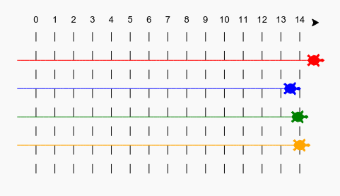

## Вступ

Використай цикли, щоб намалювати гоночну трасу і створити гру черепашачі перегони.

### Що ти зробиш

Цей проєкт знайомить з циклом for за допомогою веселої гри в черепашачі перегони. Цикли використовуються для нанесення гоночної траси та для того, щоб черепахи рухались на випадкове число кроків кожного разу. Якщо у тебе є група людей для гри, тоді кожна людина може вибрати черепаху і та, котра досягне фінішу першою перемагає.

  <iframe src="https://trinket.io/embed/python/9339862606?outputOnly=true&start=result" width="600" height="500" frameborder="0" marginwidth="0" marginheight="0" allowfullscreen>
  </iframe>
  

--- collapse ---
---
title: Чого ти навчишся
---

### Чого ти навчишся

Зробивши власну гру в черепашачіі перегони, ти навчишся:

+ Писати цикли `for` в Python
+ Використовувати випадкові числа в Python
+ Малювати лінії різного кольору за допомогою Python Turtle

Цей проєкт охоплює елементи з наступних частин [Навчального плану з цифрової розробки Raspberry Pi](https://rpf.io/curriculum){:target="_blank"}:

+ [Використовування основних конструкції програмування для створення простих програм](https://www.raspberrypi.org/curriculum/programming/creator/){:target="_blank"}

--- /collapse ---

--- collapse ---
---
title: Додаткова інформація для викладачів
---

### Додаткова інформація для вчителів

Якщо вам потрібно роздрукувати цей проєкт, будь ласка, скористайтеся [версією для друку](https://projects.raspberrypi.org/uk-UA/projects/turtle-race/print){:target="_blank"}.

Скористайтеся посиланням у нижньому колонтитулі, щоб отримати доступ до сховища GitHub для даного проєкту, яке містить усі ресурси (включаючи приклад готового проєкту) в папці "uk-UA/resources".

--- /collapse ---