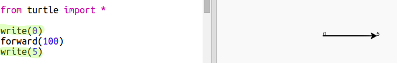

## Гоночна траса

Ти збираєшся створити гру з гоночними черепахами. Для початку їм потрібна гоночна траса.

+ Відкрий пустий шаблон для Python у Trinket (трінкет): <a href="http://jumpto.cc/python-new" target="_blank">jumpto.cc/python-new</a>.

+ Додай наступний код, щоб намалювати лінію за допомогою "turtle":
    
    

+ Тепер давай використаємо turtle, щоб намалювати розмітку для перегонів.
    
    Функція turtle `write` виводить текст на екран.
    
    Спробуй:
    
    

+ Тепер тобі треба поставити числа, щоб створити відмітки:
    
    

+ Ти помітив, що код сильно повторюється? Єдине, що змінюється — це число, яке потрібно вивести.
    
    Існує кращий спосіб це зробити в Python. Ти можеш використовувати цикл `for`.
    
    Зміни свій код, щоб використати цикл `for`:
    
    

+ Хм, таким чином друкуються лише числа до 4. У Python `range(5)` повертає п'ять чисел від 0 до 4. Щоб отримати і 5, тобі потрібно використовувати `range(6)`:
    
    

+ Тепер ти можеш намалювати деяку розмітку. Turtle починає з координат (0,0) посередині екрана.
    
    Замість цього перемісти turtle вгору вліво:
    
    

+ А, тобі ж спочатку треба підняти ручку (pen)!
    
    

+ Замість того, щоб малювати горизонтальну лінію, давай малювати вертикальні для створення траси:
    
    
    
    `right(90)` повертає turtle праворуч на 90 градусів (прямий кут). Переміщення `forward(10)` перед тим, як опустити ручку (pen), залишає невеликий проміжок між номером і початком лінії. Після нанесення лінії ти піднімаєш ручку та повертаєшся `backward(160)` на довжину лінії плюс розрив.

+ Буде виглядати охайніше, якщо вирівняти числа по центру:
    
    

+ Такожи ти можеш прискорити turtle, щоб вона малювала швидше:
    
    