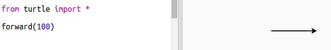

## Гонка

Ви збираєтеся створити гру з гоночних черепах. Спочатку їм потрібна гоночна траса.

+ Відкрийте пустий шаблон Python Брелок: <a href="http://jumpto.cc/python-new" target="_blank">jumpto.cc/python-new</a>.

+ Додайте наступний код, щоб намалювати лінію за допомогою "черепашки":
    
    

+ Тепер давайте використовувати черепаху, щоб намалювати певну марку доріг.
    
    Черепаха `писати` функція записує текст на екран.
    
    Спробуй це:
    
    

+ Тепер вам потрібно заповнити цифри між ними, щоб створити маркування:
    
    

+ Ви помітили, що ваш код дуже повторюється? Єдине, що змінюється - це число, яке потрібно написати.
    
    Існує кращий спосіб це зробити в Python. Ви можете використовувати `для циклу`.
    
    Оновіть код, щоб використати `для циклу`:
    
    

+ Хм, що друкує лише цифри до 4. У Python `діапазон (5)` повертає п'ять цифр від 0 до 4. Щоб отримати його також, поверніться 5, вам потрібно буде використовувати `діапазон (6)`:
    
    

+ Тепер ми можемо намалювати певні відмітки доріжки. Черепаха починається з координат (0,0) посередині екрана.
    
    Перемістіть черепаху вгору вліво замість:
    
    

+ Ах, ти спочатку хочеш підняти пену!
    
    

+ Замість того, щоб малювати лінію горизонтально, давайте намалювати вертикальні лінії для створення композиції:
    
    
    
    `праворуч (90)` робить черепашку поворотом праворуч 90 градусів (правий кут). Переміщення `вперед (10)` перед тим, як залишити перо, залишає невеликий проміжок між номером і початком рядка. Після нанесення лінії ви піднімаєте ручку та йди `назад (160)` довжину лінії плюс розрив.

+ Якщо ви орієнтуєте цифри, це виглядає краще:
    
    

+ І ви можете прискорити черепаху так, що вона тягнеться швидше:
    
    