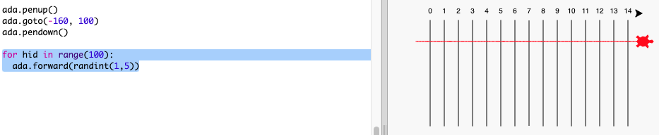
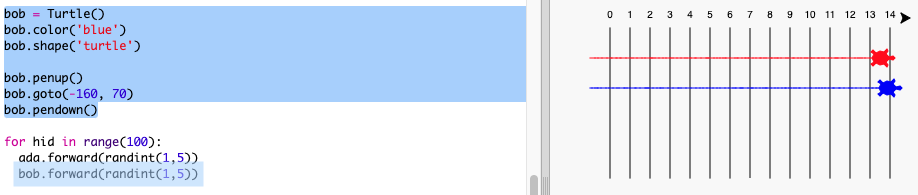

## Гонки черепахи

Зараз для забавного біту. Додамо кілька гоночних черепах. Було б дійсно нудно, якби черепахи робили те саме щоразу, щоб вони рухали випадкове число кроків у свою чергу. Переможець - черепаха, яка виходить найдальше на 100 оборотів.

+ Коли ви використовуєте команди, такі як `вперед (20)` ви використовуєте одну черепаху. Але ви можете створити більше черепах. Додайте наступний код до кінця вашого сценарію (але переконайтеся, що він не відступується):
    
    
    
    У першому рядку створюється черепаха з назвою "ada". Наступні рядки встановлюють колір і форму черепахи. Тепер це дійсно схоже на черепаху!

+ Давайте відправляти черепаху до стартової лінії:
    
    

+ Тепер вам потрібно зробити черепашку, переміщаючи випадкове число кроків одночасно. Вам потрібна функція `randint` з бібліотеки Python `random`. Додайте цю `рядок імпорту` до початку вашого сценарію:
    
    

+ Функція `randint` повертає випадкове ціле число (ціле число) між вибраними значеннями. Черепаха буде рухатися вперед по 1, 2, 3, 4 або 5 кроків на кожному кроці.
    
    

+ Одна черепаха - це не велика гонка! Додамо ще одне:
    
    
    
    Зверніть увагу, що код для переміщення синьої черепахи повинен бути в **тієї ж** `для циклу` , як код для переміщення червоної черепахи, щоб кожний з них зробив переміщення на кожному кроці.