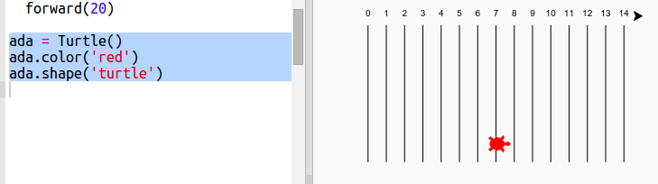

## Гоночні черепахи

А зараз час для забави. Давай створимо декілька гоночних черепах. Було б нудно, якби черепахи робили щоразу те саме, тому вони будуть рухатися на випадкове число кроків за хід. Переможець — черепаха, яка добереться найдалі на 100 ходів.

+ Коли ти використовуєш команди, типу `forward(20)`, ти використовуєш єдину turtle. Але ти можеш створити більше екземплярів turtle. Додай наступний код до кінця свого скрипта (але переконайся, що він йде без відступу):
    
    
    
    У першому рядку створюється turtle (черепаха) з іменем "ada". Наступні рядки встановлюють колір і форму turtle. Тепер вона дійсно схожа на черепаху!

+ Давай відправимо черепаху до стартової лінії:
    
    

+ Тепер тобі потрібно зробити, щоб черепашка бігла, переміщуючи її на випадкову кількість кроків щоразу. Тобі згодиться функція `randint` з бібліотеки Python `random`. Додай цей рядок `import` на початку свого скрипта:
    
    

+ Функція `randint` повертає випадкове ціле число між вибраними значеннями. Черепаха буде рухатися вперед по 1, 2, 3, 4 або 5 кроків за кожен хід.
    
    

+ Одна черепаха — це ніякі не перегони! Додамо ще одну:
    
    
    
    Зверни увагу, що код для переміщення синьої черепахи повинен бути в **тому ж** циклі `for`, що й код для переміщення червоної, щоб кожна з них робила якесь переміщення на кожному ході.